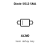
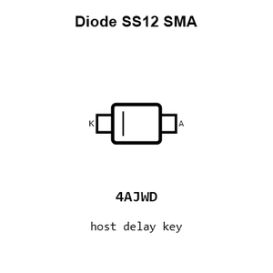
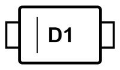
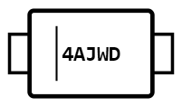
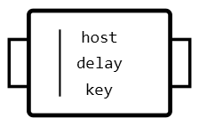
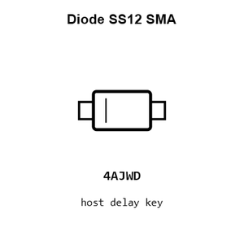
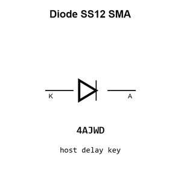
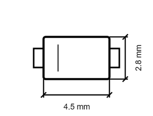

# Diode SS12 SMA

`electronic_diode_schottky_sma_mdd_microdiode_semiconductor_ss12`

Diode SS12 SMA is an OOMP electronic diode definition. It uses the sma package or form factor. Its nominal drawing size is 4.5 &#x00D7; 2.8 mm. The definition includes 2 documented pins.

## At a glance

| Detail | Value |
| --- | --- |
| OOMP ID | `electronic_diode_schottky_sma_mdd_microdiode_semiconductor_ss12` |
| Type | Diode |
| Package / style | sma |
| Nominal size | 4.5 &#x00D7; 2.8 mm |
| Documented pins | 2 |

## Classification

| Level | Value |
| --- | --- |
| 1 | `electronic` |
| 2 | `diode` |
| 3 | `schottky` |
| 4 | `sma` |
| 14 | `mdd_microdiode_semiconductor` |
| 15 | `ss12` |

## Nominal dimensions

| Measurement | Value |
| --- | ---: |
| Height | 2.3 mm |
| Length | 4.5 mm |
| Width | 2.8 mm |

## Identifiers

| Identifier | Value |
| --- | --- |
| Manufacturer part number | `SS12` |
| LCSC | [`C2479`](https://www.lcsc.com/product-detail/C2479.html) |
| JLCPCB | [`C2479`](https://jlcpcb.com/partdetail/MDD_Microdiode_Semiconductor-SS12/C2479) |

## Pins

| Pin | Name | Type |
| ---: | --- | --- |
| 1 | K | signal |
| 2 | A | signal |

## Datasheet

[View the datasheet](data/datasheet.pdf)

## Files

[KiCad symbol, machine-solder and hand-solder footprints](data/kicad/README.md) · [Availability and source masters](data/kicad/manifest.yaml)

[View this part on GitHub](https://github.com/oomlout/oomp_electronic_version_5/tree/main/parts/electronic_diode_schottky_sma_mdd_microdiode_semiconductor_ss12)

[Browse this category](../../navigation/electronic/diode/schottky/sma/mdd_microdiode_semiconductor/README.md)

---

This page is generated from the OOMP part definition by a Roboclick Jinja template. Edit the source taxonomy or template rather than this generated file.