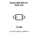
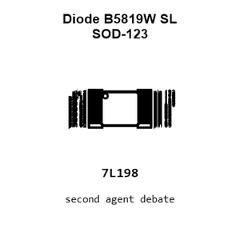
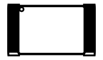
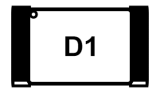
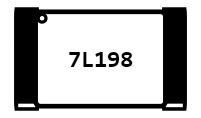
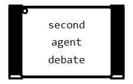
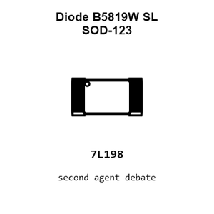
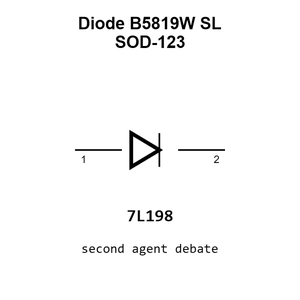
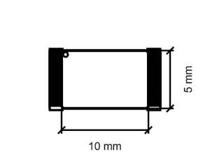

# Diode B5819W SL SOD-123

`electronic_diode_schottky_sod_123_jiangsu_changjing_electronics_technology_co_ltd_b5819w_sl`

Diode B5819W SL SOD-123 is an OOMP electronic diode definition. It uses the sod 123 package or form factor. Its nominal drawing size is 10.0 &#x00D7; 5.0 mm.

## At a glance

| Detail | Value |
| --- | --- |
| OOMP ID | `electronic_diode_schottky_sod_123_jiangsu_changjing_electronics_technology_co_ltd_b5819w_sl` |
| Type | Diode |
| Package / style | sod 123 |
| Nominal size | 10.0 &#x00D7; 5.0 mm |

## Classification

| Level | Value |
| --- | --- |
| 1 | `electronic` |
| 2 | `diode` |
| 3 | `schottky` |
| 4 | `sod_123` |
| 14 | `jiangsu_changjing_electronics_technology_co_ltd` |
| 15 | `b5819w_sl` |

## Nominal dimensions

| Measurement | Value |
| --- | ---: |
| Length | 10.0 mm |
| Width | 5.0 mm |

## Identifiers

| Identifier | Value |
| --- | --- |
| Manufacturer part number | `B5819W SL` |
| LCSC | [`C8598`](https://www.lcsc.com/product-detail/C8598.html) |
| JLCPCB | [`C8598`](https://jlcpcb.com/partdetail/9093-B5819WSL/C8598) |

## Files

[KiCad symbol, machine-solder and hand-solder footprints](data/kicad/README.md) · [Availability and source masters](data/kicad/manifest.yaml)

[View this part on GitHub](https://github.com/oomlout/oomp_electronic_version_5/tree/main/parts/electronic_diode_schottky_sod_123_jiangsu_changjing_electronics_technology_co_ltd_b5819w_sl)

[Browse this category](../../navigation/electronic/diode/schottky/sod_123/jiangsu_changjing_electronics_technology_co_ltd/README.md)

---

This page is generated from the OOMP part definition by a Roboclick Jinja template. Edit the source taxonomy or template rather than this generated file.