# Diode Schottky SOD-123

`electronic_diode_schottky_sod_123_ss14`

Diode Schottky SOD-123 is an OOMP electronic diode definition. It uses the sod 123 package or form factor. Its nominal drawing size is 3.5 &#x00D7; 1.6 mm. The definition includes 2 documented pins.

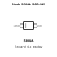

## At a glance

| Detail | Value |
| --- | --- |
| OOMP ID | `electronic_diode_schottky_sod_123_ss14` |
| Type | Diode |
| Package / style | sod 123 |
| Nominal size | 3.5 &#x00D7; 1.6 mm |
| Documented pins | 2 |

## Classification

| Level | Value |
| --- | --- |
| 1 | `electronic` |
| 2 | `diode` |
| 3 | `schottky` |
| 4 | `sod_123` |
| 15 | `ss14` |

## Nominal dimensions

| Measurement | Value |
| --- | ---: |
| Length | 3.5 mm |
| Width | 1.6 mm |

## Pins

| Pin | Name | Type |
| ---: | --- | --- |
| 1 | cathode | passive |
| 2 | anode | passive |

## Used in projects

| Project | Quantity | References | Explore |
| --- | ---: | --- | --- |
| [Project hanqaqa/easyduino ATmega328P Arduino Uno current](https://github.com/Hanqaqa/Easyduino/tree/master/Atmega328p%20Arduino%20Uno) | 2 | D2, D3 | [Board explorer](https://oomlout.github.io/oomp_electronic_version_5/parts/oomp_project_github_hanqaqa_easyduino_atmega328p_arduino_uno_current/board_explorer.html) · [OOMP project](https://github.com/oomlout/oomp_electronic_version_5/tree/main/parts/oomp_project_github_hanqaqa_easyduino_atmega328p_arduino_uno_current) |
| [Project hanqaqa/easyduino Raspberry Pi Pico 2040 current](https://github.com/Hanqaqa/Easyduino/tree/master/Raspberry%20Pi%20Pico%202040) | 1 | D1 | [Board explorer](https://oomlout.github.io/oomp_electronic_version_5/parts/oomp_project_github_hanqaqa_easyduino_raspberry_pi_pico_2040_current/board_explorer.html) · [OOMP project](https://github.com/oomlout/oomp_electronic_version_5/tree/main/parts/oomp_project_github_hanqaqa_easyduino_raspberry_pi_pico_2040_current) |

## Files

[KiCad symbol, machine-solder and hand-solder footprints](data/kicad/README.md) · [Availability and source masters](data/kicad/manifest.yaml)

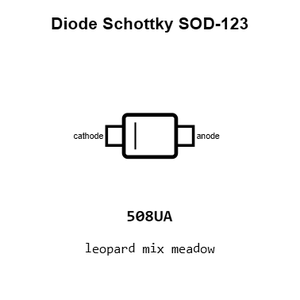

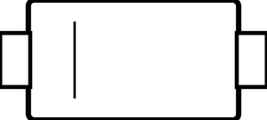

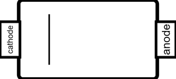

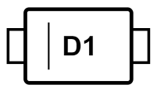

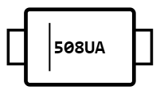

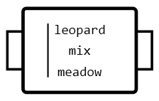

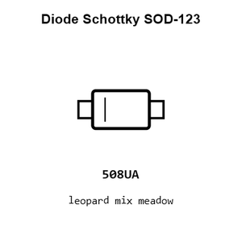

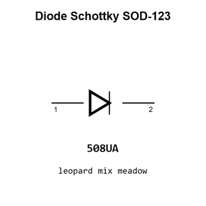

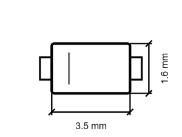

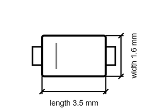

[View this part on GitHub](https://github.com/oomlout/oomp_electronic_version_5/tree/main/parts/electronic_diode_schottky_sod_123_ss14)

[Browse this category](../../navigation/electronic/diode/schottky/sod_123/README.md)

---

This page is generated from the OOMP part definition by a Roboclick Jinja template. Edit the source taxonomy or template rather than this generated file.