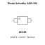
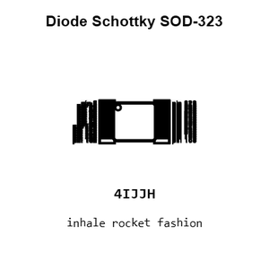
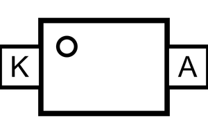
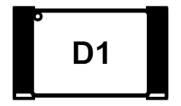
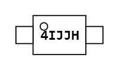
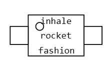
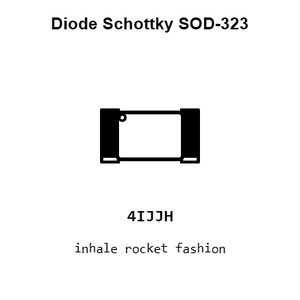
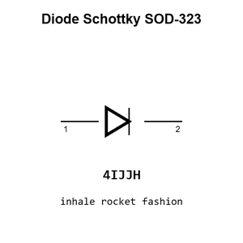
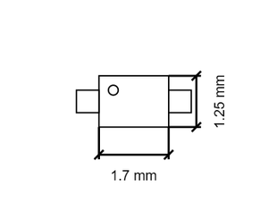
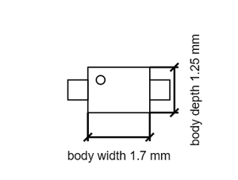

# Diode Schottky SOD-323

`electronic_diode_schottky_sod_323_infineon_bat20j`

Diode Schottky SOD-323 is an OOMP electronic diode definition. It uses the sod 323 package or form factor. Its nominal drawing size is 1.7 &#x00D7; 1.25 mm. The definition includes 2 documented pins.

## At a glance

| Detail | Value |
| --- | --- |
| OOMP ID | `electronic_diode_schottky_sod_323_infineon_bat20j` |
| Type | Diode |
| Package / style | sod 323 |
| Nominal size | 1.7 &#x00D7; 1.25 mm |
| Documented pins | 2 |

## Classification

| Level | Value |
| --- | --- |
| 1 | `electronic` |
| 2 | `diode` |
| 3 | `schottky` |
| 4 | `sod_323` |
| 14 | `infineon` |
| 15 | `bat20j` |

## Nominal dimensions

| Measurement | Value |
| --- | ---: |
| Length | 1.7 mm |
| Width | 1.25 mm |

## Pins

| Pin | Name | Type |
| ---: | --- | --- |
| 1 | K | signal |
| 2 | A | signal |

## Used in projects

| Project | Quantity | References | Explore |
| --- | ---: | --- | --- |
| [Project adafruit/Adafruit-ItsyBitsy-ESP32-PCB Adafruit Itsy Bitsy ESP32 current](https://github.com/adafruit/Adafruit-ItsyBitsy-ESP32-PCB/blob/main/Adafruit%20ItsyBitsy%20ESP32.brd) | 2 | D1, D3 | [Board explorer](https://oomlout.github.io/oomp_electronic_version_5/parts/oomp_project_github_adafruit_adafruit_itsy_bitsy_esp32_pcb_adafruit_itsy_bitsy_esp32_current/board_explorer.html) · [OOMP project](https://github.com/oomlout/oomp_electronic_version_5/tree/main/parts/oomp_project_github_adafruit_adafruit_itsy_bitsy_esp32_pcb_adafruit_itsy_bitsy_esp32_current) |
| [Project soldered_electronics/Capacitive-soil-sensor-hardware-design Capacitive Soil Sensor current](https://github.com/SolderedElectronics/Capacitive-soil-sensor-hardware-design) | 1 | D1 | [Board explorer](https://oomlout.github.io/oomp_electronic_version_5/parts/oomp_project_github_soldered_electronics_capacitive_soil_sensor_hardware_design_sensor_capacitive_soil_current/board_explorer.html) · [OOMP project](https://github.com/oomlout/oomp_electronic_version_5/tree/main/parts/oomp_project_github_soldered_electronics_capacitive_soil_sensor_hardware_design_sensor_capacitive_soil_current) |
| [Project sparkfun/Blynk_Board_ESP8266 Spark Fun Blynk Board ESP8266 current](https://github.com/sparkfun/Blynk_Board_ESP8266/blob/master/Hardware/SparkFun-Blynk-Board-ESP8266.brd) | 1 | D2 | [Board explorer](https://oomlout.github.io/oomp_electronic_version_5/parts/oomp_project_github_sparkfun_blynk_board_esp8266_spark_fun_blynk_board_esp8266_current/board_explorer.html) · [OOMP project](https://github.com/oomlout/oomp_electronic_version_5/tree/main/parts/oomp_project_github_sparkfun_blynk_board_esp8266_spark_fun_blynk_board_esp8266_current) |
| [Project sparkfun/ESP32_Thing esp32 thing current](https://github.com/sparkfun/ESP32_Thing/blob/master/Hardware/esp32-thing.brd) | 1 | D2 | [Board explorer](https://oomlout.github.io/oomp_electronic_version_5/parts/oomp_project_github_sparkfun_esp32_thing_esp32_thing_current/board_explorer.html) · [OOMP project](https://github.com/oomlout/oomp_electronic_version_5/tree/main/parts/oomp_project_github_sparkfun_esp32_thing_esp32_thing_current) |
| [Project sparkfun/ESP8266_Thing_Dev ESP8266 Thing Dev current](https://github.com/sparkfun/ESP8266_Thing_Dev/blob/master/Hardware/ESP8266-Thing-Dev.brd) | 1 | D1 | [Board explorer](https://oomlout.github.io/oomp_electronic_version_5/parts/oomp_project_github_sparkfun_esp8266_thing_dev_esp8266_thing_dev_current/board_explorer.html) · [OOMP project](https://github.com/oomlout/oomp_electronic_version_5/tree/main/parts/oomp_project_github_sparkfun_esp8266_thing_dev_esp8266_thing_dev_current) |
| [Project sparkfun/ESP8266_Thing Spark Fun ESP8266 Thinga current](https://github.com/sparkfun/ESP8266_Thing/blob/master/Hardware/SparkFun_ESP8266_Thing_V10a.brd) | 1 | D3 | [Board explorer](https://oomlout.github.io/oomp_electronic_version_5/parts/oomp_project_github_sparkfun_esp8266_thing_spark_fun_esp8266_thinga_current/board_explorer.html) · [OOMP project](https://github.com/oomlout/oomp_electronic_version_5/tree/main/parts/oomp_project_github_sparkfun_esp8266_thing_spark_fun_esp8266_thinga_current) |
| [Project sparkfun/SAMD21_Dev_Breakout sparkfun samd21 pro breakout current](https://github.com/sparkfun/SAMD21_Dev_Breakout/blob/master/Hardware/sparkfun-samd21-pro-breakout.brd) | 1 | D1 | [Board explorer](https://oomlout.github.io/oomp_electronic_version_5/parts/oomp_project_github_sparkfun_samd21_dev_breakout_sparkfun_samd21_pro_breakout_current/board_explorer.html) · [OOMP project](https://github.com/oomlout/oomp_electronic_version_5/tree/main/parts/oomp_project_github_sparkfun_samd21_dev_breakout_sparkfun_samd21_pro_breakout_current) |

## Files

[KiCad symbol, machine-solder and hand-solder footprints](data/kicad/README.md) · [Availability and source masters](data/kicad/manifest.yaml)

[View this part on GitHub](https://github.com/oomlout/oomp_electronic_version_5/tree/main/parts/electronic_diode_schottky_sod_323_infineon_bat20j)

[Browse this category](../../navigation/electronic/diode/schottky/sod_323/infineon/README.md)

---

This page is generated from the OOMP part definition by a Roboclick Jinja template. Edit the source taxonomy or template rather than this generated file.