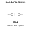
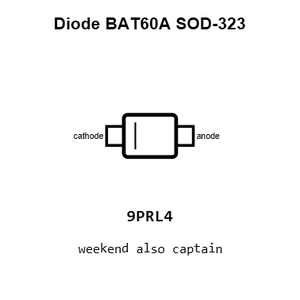
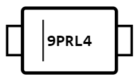
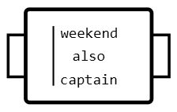
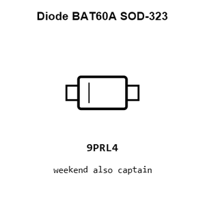

# Diode BAT60A SOD-323

`electronic_diode_schottky_sod_323_infineon_bat60a`

Diode BAT60A SOD-323 is an OOMP electronic diode definition. It uses the sod 323 package or form factor. Its nominal drawing size is 2.1 &#x00D7; 1.25 mm. The definition includes 2 documented pins.

## At a glance

| Detail | Value |
| --- | --- |
| OOMP ID | `electronic_diode_schottky_sod_323_infineon_bat60a` |
| Type | Diode |
| Package / style | sod 323 |
| Nominal size | 2.1 &#x00D7; 1.25 mm |
| Documented pins | 2 |

## Classification

| Level | Value |
| --- | --- |
| 1 | `electronic` |
| 2 | `diode` |
| 3 | `schottky` |
| 4 | `sod_323` |
| 14 | `infineon` |
| 15 | `bat60a` |

## Nominal dimensions

| Measurement | Value |
| --- | ---: |
| Length | 2.1 mm |
| Width | 1.25 mm |

## Identifiers

| Identifier | Value |
| --- | --- |
| Manufacturer part number | `BAT60A` |
| LCSC | [`C520634`](https://www.lcsc.com/product-detail/C520634.html) |

## Pins

| Pin | Name | Type |
| ---: | --- | --- |
| 1 | cathode | passive |
| 2 | anode | passive |

## Files

[KiCad symbol, machine-solder and hand-solder footprints](data/kicad/README.md) · [Availability and source masters](data/kicad/manifest.yaml)

[View this part on GitHub](https://github.com/oomlout/oomp_electronic_version_5/tree/main/parts/electronic_diode_schottky_sod_323_infineon_bat60a)

[Browse this category](../../navigation/electronic/diode/schottky/sod_323/infineon/README.md)

---

This page is generated from the OOMP part definition by a Roboclick Jinja template. Edit the source taxonomy or template rather than this generated file.