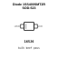
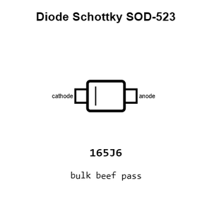
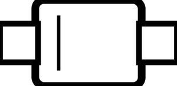
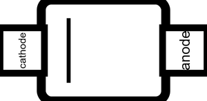
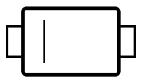
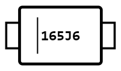
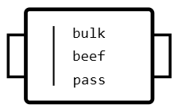
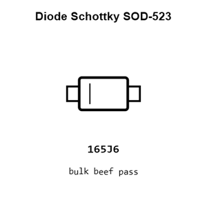

# Diode Schottky SOD-523

`electronic_diode_schottky_sod_523_1ss400`

Diode Schottky SOD-523 is an OOMP electronic diode definition. It uses the sod 523 package or form factor. Its nominal drawing size is 1.6 &#x00D7; 0.8 mm. The definition includes 2 documented pins.

## At a glance

| Detail | Value |
| --- | --- |
| OOMP ID | `electronic_diode_schottky_sod_523_1ss400` |
| Type | Diode |
| Package / style | sod 523 |
| Nominal size | 1.6 &#x00D7; 0.8 mm |
| Documented pins | 2 |

## Classification

| Level | Value |
| --- | --- |
| 1 | `electronic` |
| 2 | `diode` |
| 3 | `schottky` |
| 4 | `sod_523` |
| 15 | `1ss400` |

## Nominal dimensions

| Measurement | Value |
| --- | ---: |
| Length | 1.6 mm |
| Width | 0.8 mm |

## Pins

| Pin | Name | Type |
| ---: | --- | --- |
| 1 | cathode | passive |
| 2 | anode | passive |

## Files

[KiCad symbol, machine-solder and hand-solder footprints](data/kicad/README.md) · [Availability and source masters](data/kicad/manifest.yaml)

[View this part on GitHub](https://github.com/oomlout/oomp_electronic_version_5/tree/main/parts/electronic_diode_schottky_sod_523_1ss400)

[Browse this category](../../navigation/electronic/diode/schottky/sod_523/README.md)

---

This page is generated from the OOMP part definition by a Roboclick Jinja template. Edit the source taxonomy or template rather than this generated file.