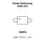
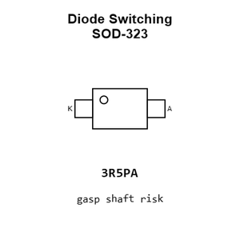
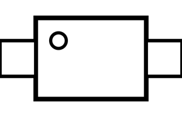
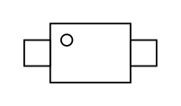
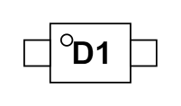
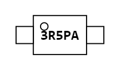
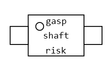
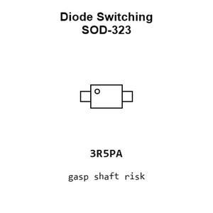
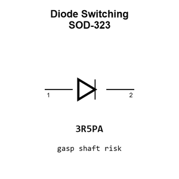

# Diode Switching SOD-323

`electronic_diode_switching_sod_323_onsemi_1n4148ws`

Diode Switching SOD-323 is an OOMP electronic diode definition. It uses the sod 323 package or form factor. Its nominal drawing size is 1.7 &#x00D7; 1.25 mm. The definition includes 2 documented pins.

## At a glance

| Detail | Value |
| --- | --- |
| OOMP ID | `electronic_diode_switching_sod_323_onsemi_1n4148ws` |
| Type | Diode |
| Package / style | sod 323 |
| Nominal size | 1.7 &#x00D7; 1.25 mm |
| Documented pins | 2 |

## Classification

| Level | Value |
| --- | --- |
| 1 | `electronic` |
| 2 | `diode` |
| 3 | `switching` |
| 4 | `sod_323` |
| 14 | `onsemi` |
| 15 | `1n4148ws` |

## Nominal dimensions

| Measurement | Value |
| --- | ---: |
| Length | 1.7 mm |
| Width | 1.25 mm |

## Pins

| Pin | Name | Type |
| ---: | --- | --- |
| 1 | K | signal |
| 2 | A | signal |

## Used in projects

| Project | Quantity | References | Explore |
| --- | ---: | --- | --- |
| [Project adafruit/Adafruit-LIS3DH-Breakout-PCB LIS3DH Breakout current](https://github.com/adafruit/Adafruit-LIS3DH-Breakout-PCB/blob/master/Adafruit%20LIS3DH.brd) | 1 | D2 | [Board explorer](https://oomlout.github.io/oomp_electronic_version_5/parts/oomp_project_github_adafruit_adafruit_lis3_dh_breakout_pcb_lis3dh_breakout_current/board_explorer.html) · [OOMP project](https://github.com/oomlout/oomp_electronic_version_5/tree/main/parts/oomp_project_github_adafruit_adafruit_lis3_dh_breakout_pcb_lis3dh_breakout_current) |

## Files

[KiCad symbol, machine-solder and hand-solder footprints](data/kicad/README.md) · [Availability and source masters](data/kicad/manifest.yaml)

[View this part on GitHub](https://github.com/oomlout/oomp_electronic_version_5/tree/main/parts/electronic_diode_switching_sod_323_onsemi_1n4148ws)

[Browse this category](../../navigation/electronic/diode/switching/sod_323/onsemi/README.md)

---

This page is generated from the OOMP part definition by a Roboclick Jinja template. Edit the source taxonomy or template rather than this generated file.