# Diode 1N4148WS SOD-323

`electronic_diode_switching_sod_323_onsemi_1n4148ws`

Diode 1N4148WS SOD-323 is an OOMP electronic diode definition. It uses the sod 323 package or form factor. Its nominal drawing size is 1.7 &#x00D7; 1.25 mm. The definition includes 2 documented pins.

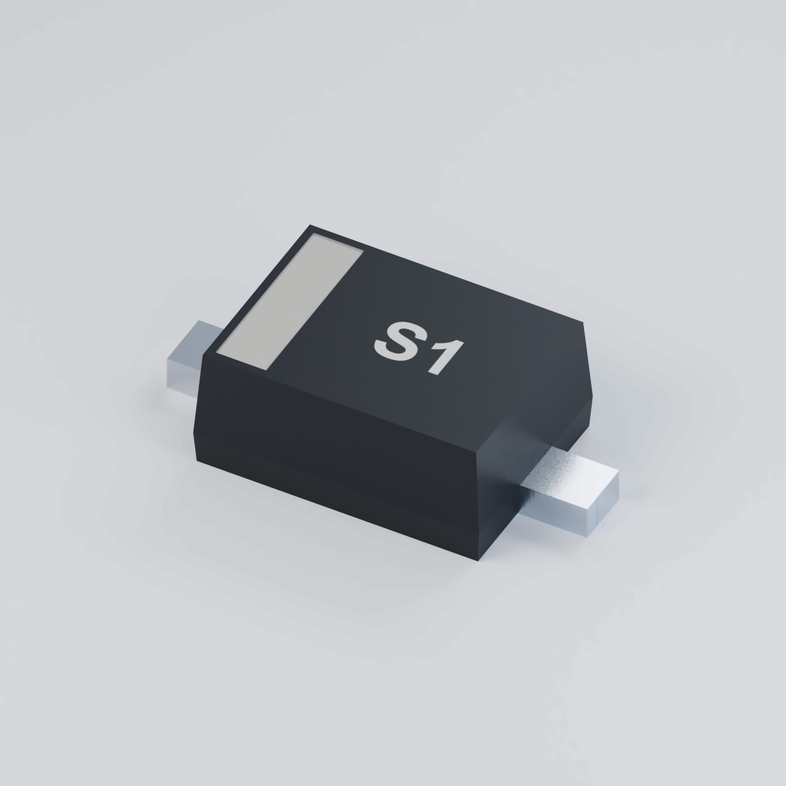

KiCad SOD-323F flat-lead display model approximates the different-manufacturer onsemi SOD-323FL drawing, with a cathode stripe on the pin-1 side. The source record instead selects a SOD-323 footprint; this difference is unverified. The local PDF is a JCST example. Not manufacturing CAD or a footprint. S1 is an illustrative different-manufacturer onsemi example; the JSCJ factory marking and exact package variant are unconfirmed. Production codes are omitted; typeface and placement are illustrative.

[Render recipe and provenance](data/display_render/manifest.json) · [KiCad model](https://gitlab.com/kicad/libraries/kicad-packages3D/-/blob/master/Diode_SMD.3dshapes/D_SOD-323F.step)

Model credit: 2025 KiCAD. CC-BY-SA-4.0 with KiCad library exception; see original STEP header.

## At a glance

| Detail | Value |
| --- | --- |
| OOMP ID | `electronic_diode_switching_sod_323_onsemi_1n4148ws` |
| Type | Diode |
| Package / style | sod 323 |
| Nominal size | 1.7 &#x00D7; 1.25 mm |
| Documented pins | 2 |

## Classification

| Level | Value |
| --- | --- |
| 1 | `electronic` |
| 2 | `diode` |
| 3 | `switching` |
| 4 | `sod_323` |
| 14 | `onsemi` |
| 15 | `1n4148ws` |

## Nominal dimensions

| Measurement | Value |
| --- | ---: |
| Length | 1.7 mm |
| Width | 1.25 mm |

## Identifiers

| Identifier | Value |
| --- | --- |
| Manufacturer part number | `1N4148WS` |
| LCSC | [`C2128`](https://www.lcsc.com/product-detail/C2128.html) |
| JLCPCB | [`C2128`](https://jlcpcb.com/partdetail/2485-1N4148WS/C2128) |

## Pins

| Pin | Name | Type |
| ---: | --- | --- |
| 1 | K | signal |
| 2 | A | signal |

## Datasheet

[View the datasheet](data/datasheet.pdf)

## Used in projects

[Browse confirmed project usage](https://oomlout.github.io/oomp_electronic_project_version_5/usage/index.html#electronic_diode_switching_sod_323_onsemi_1n4148ws)

## Files

<!-- oomp-part-file-table -->

| Image type | Image | Link |
| --- | :---: | --- |
| **Studio render** | 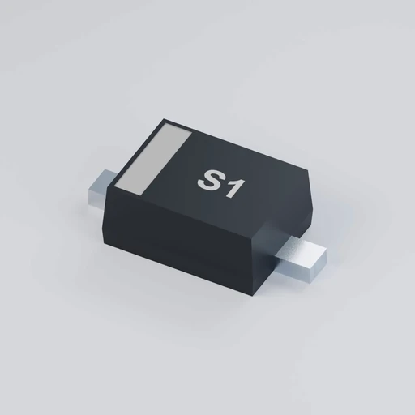 | [PNG](data/display_render/render.png) · [Preview](data/display_render/preview.webp) |
| **Pinout drawing** Pin names and positions on the part. | 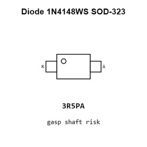 | [SVG](data/working_svg_square_pins.svg) · [PNG](data/working_svg_square_pins.png) · [Preview](data/working_svg_square_pins_300.png) |
| **Assembly** Component placement drawing. |  | [SVG](data/working_svg_assembly.svg) · [PNG](data/working_svg_assembly.png) · [Preview](data/working_svg_assembly_300.png) |
| **Assembly pinout** Placement drawing with the pins marked. | 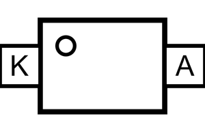 | [SVG](data/working_svg_assembly_pins.svg) · [PNG](data/working_svg_assembly_pins.png) · [Preview](data/working_svg_assembly_pins_300.png) |
| **Outline** External shape of the part. | 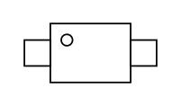 | [SVG](data/working_svg_outline.svg) · [PNG](data/working_svg_outline.png) · [Preview](data/working_svg_outline_300.png) |
| **Dimensions** Package outline with dimension arrows. | 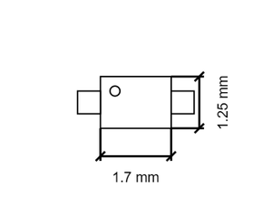 | [SVG](data/working_svg_dimensioned.svg) · [PNG](data/working_svg_dimensioned.png) · [Preview](data/working_svg_dimensioned_300.png) |
| **Dimensions with labels** Labelled package measurements. | 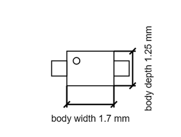 | [SVG](data/working_svg_dimensioned_titles.svg) · [PNG](data/working_svg_dimensioned_titles.png) · [Preview](data/working_svg_dimensioned_titles_300.png) |
| **Square summary** Component identification card. | 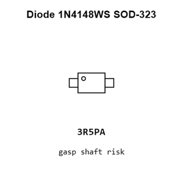 | [SVG](data/working_svg_square.svg) · [PNG](data/working_svg_square.png) · [Preview](data/working_svg_square_300.png) |
| **Square schematic** Schematic symbol on an identification card. | 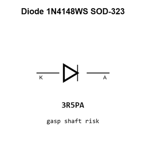 | [SVG](data/working_svg_square_schematic.svg) · [PNG](data/working_svg_square_schematic.png) · [Preview](data/working_svg_square_schematic_300.png) |
| **Part ID** Drawing labelled with the OOMP catalogue ID. | 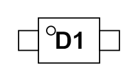 | [SVG](data/working_svg_part_id.svg) · [PNG](data/working_svg_part_id.png) · [Preview](data/working_svg_part_id_300.png) |
| **MD5 alpha** Drawing labelled with the short OOMP code. | 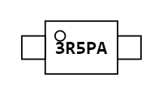 | [SVG](data/working_svg_md5_6_alpha.svg) · [PNG](data/working_svg_md5_6_alpha.png) · [Preview](data/working_svg_md5_6_alpha_300.png) |
| **BIP 39 words** Drawing labelled with the three-word identifier. | 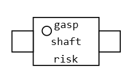 | [SVG](data/working_svg_bip_39_3_word.svg) · [PNG](data/working_svg_bip_39_3_word.png) · [Preview](data/working_svg_bip_39_3_word_300.png) |
| **Schematic** Electrical symbol for the part. | 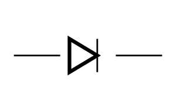 | [SVG](data/working_svg_schematic.svg) · [PNG](data/working_svg_schematic.png) · [Preview](data/working_svg_schematic_300.png) |
| **Schematic pinout** Electrical symbol with pin labels. | 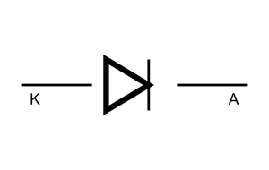 | [SVG](data/working_svg_schematic_pins.svg) · [PNG](data/working_svg_schematic_pins.png) · [Preview](data/working_svg_schematic_pins_300.png) |
| **Schematic with part ID** Symbol labelled with the OOMP catalogue ID. | 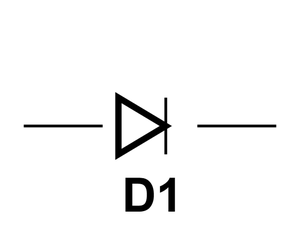 | [SVG](data/working_svg_schematic_part_id.svg) · [PNG](data/working_svg_schematic_part_id.png) · [Preview](data/working_svg_schematic_part_id_300.png) |
| **Schematic with MD5 alpha** Symbol labelled with the short OOMP code. | 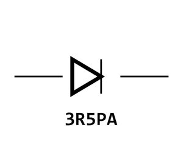 | [SVG](data/working_svg_schematic_md5_6_alpha.svg) · [PNG](data/working_svg_schematic_md5_6_alpha.png) · [Preview](data/working_svg_schematic_md5_6_alpha_300.png) |
| **Schematic with BIP 39 words** Symbol labelled with the three-word identifier. | 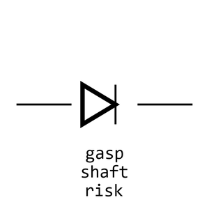 | [SVG](data/working_svg_schematic_bip_39_3_word.svg) · [PNG](data/working_svg_schematic_bip_39_3_word.png) · [Preview](data/working_svg_schematic_bip_39_3_word_300.png) |
| **Diagram contact sheet** Component drawings together in one image. | 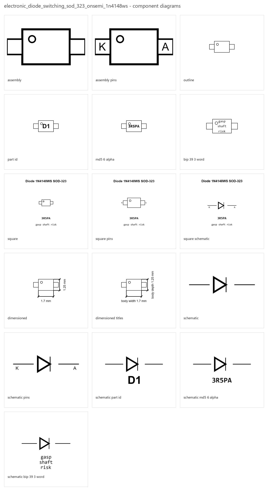 | [PNG](data/working_svg_contact_sheet.png) |
| **KiCad asset licence** | — | [MD](data/kicad/LICENSE.md) |
| **KiCad library guide** | — | [MD](data/kicad/README.md) |
| **KiCad symbol and footprint overview** | 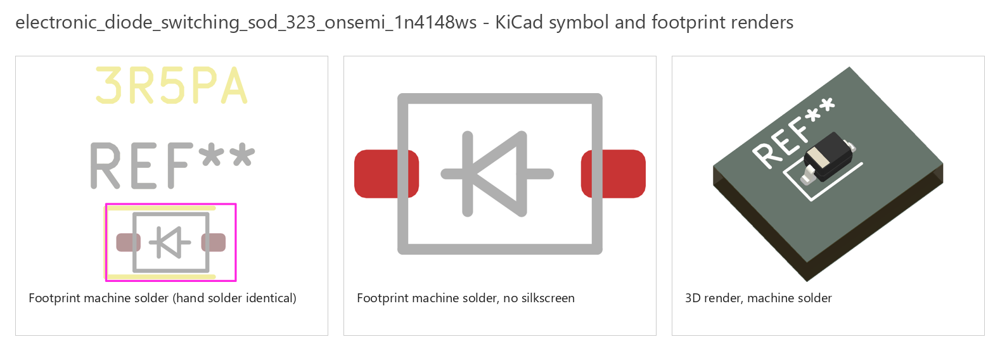 | [PNG](data/kicad/contact_sheet.png) |
| **KiCad symbol library** | — | [KICAD_SYM](data/kicad/electronic_diode_switching_sod_323_onsemi_1n4148ws.kicad_sym) |
| **Hand-solder footprint guide** | — | [MD](data/kicad/hand_solder/README.md) |
| **Hand-solder footprint** | — | [KICAD_MOD](data/kicad/hand_solder/electronic_diode_switching_sod_323_onsemi_1n4148ws.kicad_mod) |
| **Machine-solder footprint drawing** | 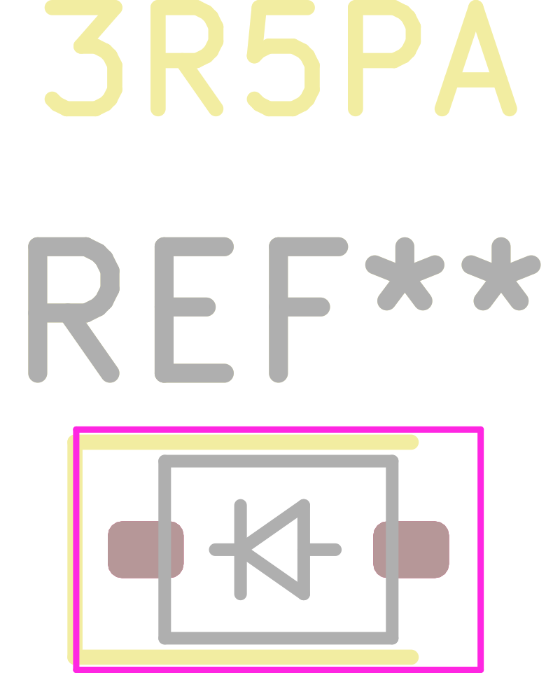 | [SVG](data/kicad/kicad_footprint_machine_solder.svg) · [PNG](data/kicad/kicad_footprint_machine_solder.png) · [STEP](data/kicad/kicad_footprint_machine_solder.step) |
| **Machine-solder footprint (3D view)** | 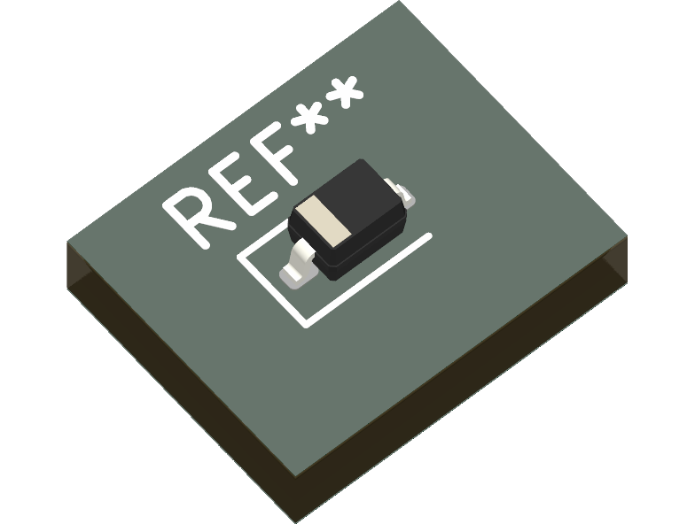 | [PNG](data/kicad/kicad_footprint_machine_solder_3d.png) |
| **Machine-solder footprint (without silkscreen)** |  | [SVG](data/kicad/kicad_footprint_machine_solder_bare.svg) · [PNG](data/kicad/kicad_footprint_machine_solder_bare.png) |
| **Machine-solder footprint (without silkscreen, square view)** | 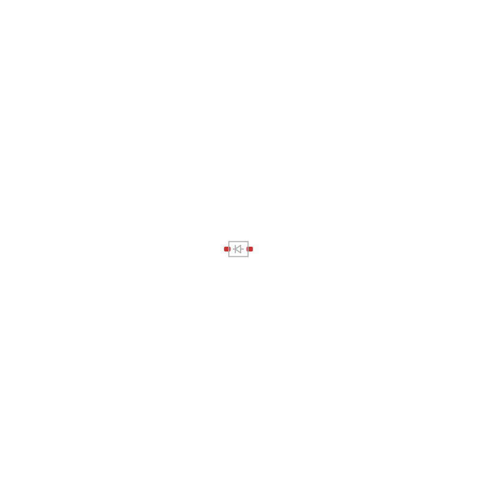 | [SVG](data/kicad/kicad_footprint_machine_solder_bare_square.svg) · [PNG](data/kicad/kicad_footprint_machine_solder_bare_square.png) |
| **Machine-solder footprint (square view)** |  | [SVG](data/kicad/kicad_footprint_machine_solder_square.svg) · [PNG](data/kicad/kicad_footprint_machine_solder_square.png) |
| **Machine-solder footprint guide** | — | [MD](data/kicad/machine_solder/README.md) |
| **Machine-solder footprint** | — | [KICAD_MOD](data/kicad/machine_solder/electronic_diode_switching_sod_323_onsemi_1n4148ws.kicad_mod) |
| **KiCad availability and source masters** | — | [JSON](data/kicad/manifest.json) · [YAML](data/kicad/manifest.yaml) |
| **Studio render sources and recipe** | — | [JSON](data/display_render/manifest.json) |
| **Manufacturer or supplier datasheet** | — | [PDF](data/datasheet.pdf) |
| **Drawer label data** | — | [YAML](data/label_drawer.yaml) |
| **Generator label** |  | [SVG](generator_label.svg) · [JSON](generator_label.json) |
| **Small drawer label** | 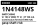 | [SVG](label_drawer_1_5x1.svg) |
| **Large drawer label** | 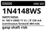 | [SVG](label_drawer_3x2.svg) |
| **Web catalogue file index** | — | [YAML](web.yaml) |
| **Part definition and build recipe** | — | [YAML](working.yaml) |

<!-- /oomp-part-file-table -->

[View this part on GitHub](https://github.com/oomlout/oomp_electronic_version_5/tree/main/parts/electronic_diode_switching_sod_323_onsemi_1n4148ws)

[Browse this category](../../navigation/electronic/diode/switching/sod_323/onsemi/README.md)

---

This page is generated from the OOMP part definition by a Roboclick Jinja template. Edit the source taxonomy or template rather than this generated file.