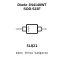
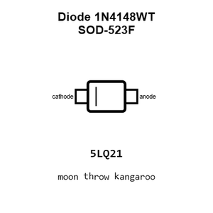
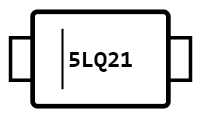
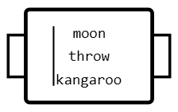
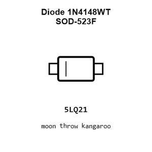
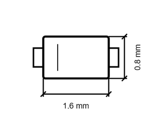
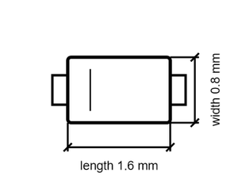

# Diode 1N4148WT SOD-523F

`electronic_diode_switching_sod_523f_onsemi_1n4148wt`

Diode 1N4148WT SOD-523F is an OOMP electronic diode definition. It uses the sod 523f package or form factor. Its nominal drawing size is 1.6 &#x00D7; 0.8 mm. The definition includes 2 documented pins.

## At a glance

| Detail | Value |
| --- | --- |
| OOMP ID | `electronic_diode_switching_sod_523f_onsemi_1n4148wt` |
| Type | Diode |
| Package / style | sod 523f |
| Nominal size | 1.6 &#x00D7; 0.8 mm |
| Documented pins | 2 |

## Classification

| Level | Value |
| --- | --- |
| 1 | `electronic` |
| 2 | `diode` |
| 3 | `switching` |
| 4 | `sod_523f` |
| 14 | `onsemi` |
| 15 | `1n4148wt` |

## Nominal dimensions

| Measurement | Value |
| --- | ---: |
| Length | 1.6 mm |
| Width | 0.8 mm |

## Identifiers

| Identifier | Value |
| --- | --- |
| Manufacturer part number | `1N4148WT` |
| LCSC | [`C232841`](https://www.lcsc.com/product-detail/C232841.html) |

## Pins

| Pin | Name | Type |
| ---: | --- | --- |
| 1 | cathode | passive |
| 2 | anode | passive |

## Used in projects

| Project | Quantity | References | Explore |
| --- | ---: | --- | --- |
| [Project dangerousprototypes/buspirate5_hardware 5_rev10a](https://github.com/DangerousPrototypes/BusPirate5-hardware) | 4 | D401, D601, D602, D603 | [Board explorer](https://oomlout.github.io/oomp_electronic_version_5/parts/oomp_project_github_dangerousprototypes_buspirate5_hardware_5_rev10a/board_explorer.html) · [OOMP project](https://github.com/oomlout/oomp_electronic_version_5/tree/main/parts/oomp_project_github_dangerousprototypes_buspirate5_hardware_5_rev10a) |

## Files

[KiCad symbol, machine-solder and hand-solder footprints](data/kicad/README.md) · [Availability and source masters](data/kicad/manifest.yaml)

[View this part on GitHub](https://github.com/oomlout/oomp_electronic_version_5/tree/main/parts/electronic_diode_switching_sod_523f_onsemi_1n4148wt)

[Browse this category](../../navigation/electronic/diode/switching/sod_523f/onsemi/README.md)

---

This page is generated from the OOMP part definition by a Roboclick Jinja template. Edit the source taxonomy or template rather than this generated file.