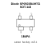
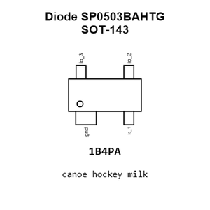
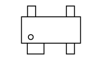
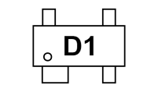
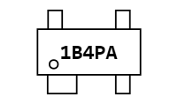
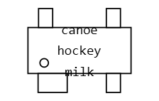
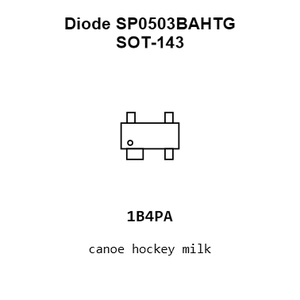
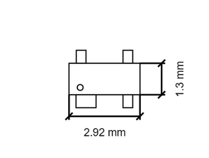
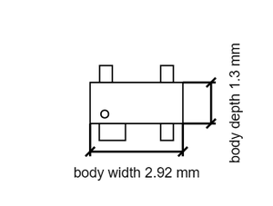

# Diode SP0503BAHTG SOT-143

`electronic_diode_tvs_array_sot_143_littelfuse_sp0503bahtg`

Diode SP0503BAHTG SOT-143 is an OOMP electronic diode definition. It uses the sot 143 package or form factor. Its nominal drawing size is 2.92 &#x00D7; 2.37 mm. The definition includes 4 documented pins.

## At a glance

| Detail | Value |
| --- | --- |
| OOMP ID | `electronic_diode_tvs_array_sot_143_littelfuse_sp0503bahtg` |
| Type | Diode |
| Package / style | sot 143 |
| Nominal size | 2.92 &#x00D7; 2.37 mm |
| Documented pins | 4 |

## Classification

| Level | Value |
| --- | --- |
| 1 | `electronic` |
| 2 | `diode` |
| 3 | `tvs_array` |
| 4 | `sot_143` |
| 14 | `littelfuse` |
| 15 | `sp0503bahtg` |

## Nominal dimensions

| Measurement | Value |
| --- | ---: |
| Length | 2.92 mm |
| Width | 2.37 mm |

## Identifiers

| Identifier | Value |
| --- | --- |
| Manufacturer part number | `SP0503BAHTG` |
| LCSC | [`C7074`](https://www.lcsc.com/product-detail/C7074.html) |

## Pins

| Pin | Name | Type |
| ---: | --- | --- |
| 1 | gnd | gnd |
| 2 | io_1 | signal |
| 3 | io_2 | signal |
| 4 | io_3 | signal |

## Datasheet

[View the datasheet](data/datasheet.pdf)

## Used in projects

| Project | Quantity | References | Explore |
| --- | ---: | --- | --- |
| [Project hanqaqa/easyduino ESP32 current](https://github.com/Hanqaqa/Easyduino/tree/master/ESP32) | 1 | D1 | [Board explorer](https://oomlout.github.io/oomp_electronic_version_5/parts/oomp_project_github_hanqaqa_easyduino_esp32_current/board_explorer.html) · [OOMP project](https://github.com/oomlout/oomp_electronic_version_5/tree/main/parts/oomp_project_github_hanqaqa_easyduino_esp32_current) |

## Files

[KiCad symbol, machine-solder and hand-solder footprints](data/kicad/README.md) · [Availability and source masters](data/kicad/manifest.yaml)

[View this part on GitHub](https://github.com/oomlout/oomp_electronic_version_5/tree/main/parts/electronic_diode_tvs_array_sot_143_littelfuse_sp0503bahtg)

[Browse this category](../../navigation/electronic/diode/tvs_array/sot_143/littelfuse/README.md)

---

This page is generated from the OOMP part definition by a Roboclick Jinja template. Edit the source taxonomy or template rather than this generated file.