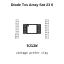
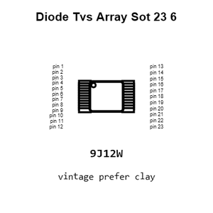
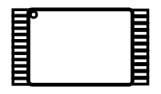
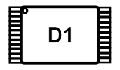
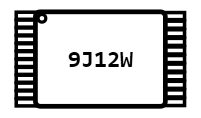
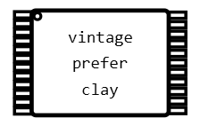
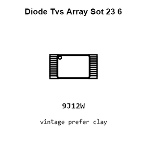
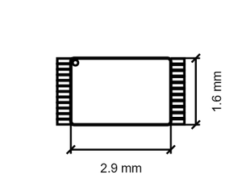
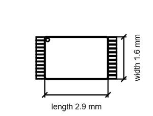

# Diode Tvs Array Sot 23 6

`electronic_diode_tvs_array_sot_23_6_protek_srv054pt7`

Diode Tvs Array Sot 23 6 is an OOMP electronic diode definition. It uses the tvs array package or form factor. Its nominal drawing size is 2.9 × 1.6 mm.

## At a glance

| Detail | Value |
| --- | --- |
| OOMP ID | `electronic_diode_tvs_array_sot_23_6_protek_srv054pt7` |
| Type | Diode |
| Package / style | tvs array |
| Nominal size | 2.9 × 1.6 mm |

## Classification

| Level | Value |
| --- | --- |
| 1 | `electronic` |
| 2 | `diode` |
| 3 | `tvs_array` |
| 4 | `sot_23_6` |
| 14 | `protek` |
| 15 | `srv054pt7` |

## Nominal dimensions

| Measurement | Value |
| --- | ---: |
| Length | 2.9 mm |
| Width | 1.6 mm |

## Identifiers

| Identifier | Value |
| --- | --- |
| Manufacturer part number | `SRV05-4-P-T7` |
| LCSC | `C85364` |

## Files

[View this part on GitHub](https://github.com/oomlout/oomp_electronic_version_5/tree/main/parts/electronic_diode_tvs_array_sot_23_6_protek_srv054pt7)

---

This page is generated from the OOMP part definition by a Roboclick Jinja template. Edit the source taxonomy or template rather than this generated file.
