# Diode ESDA6V1-5SC6 SOT-23-6

`electronic_diode_tvs_array_sot_23_6_stmicroelectronics_esda6v1_5sc6`

Diode ESDA6V1-5SC6 SOT-23-6 is an OOMP electronic diode definition. It uses the sot 23 6 package or form factor. Its nominal drawing size is 2.9 &#x00D7; 1.3 mm. The definition includes 6 documented pins.

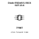

## At a glance

| Detail | Value |
| --- | --- |
| OOMP ID | `electronic_diode_tvs_array_sot_23_6_stmicroelectronics_esda6v1_5sc6` |
| Type | Diode |
| Package / style | sot 23 6 |
| Nominal size | 2.9 &#x00D7; 1.3 mm |
| Documented pins | 6 |

## Classification

| Level | Value |
| --- | --- |
| 1 | `electronic` |
| 2 | `diode` |
| 3 | `tvs_array` |
| 4 | `sot_23_6` |
| 14 | `stmicroelectronics` |
| 15 | `esda6v1_5sc6` |

## Nominal dimensions

| Measurement | Value |
| --- | ---: |
| Height | 1.1 mm |
| Length | 2.9 mm |
| Width | 1.3 mm |

## Identifiers

| Identifier | Value |
| --- | --- |
| Manufacturer part number | `ESDA6V1-5SC6` |
| LCSC | [`C6650`](https://www.lcsc.com/product-detail/C6650.html) |
| JLCPCB | [`C6650`](https://jlcpcb.com/partdetail/STMicroelectronics-ESDA6V15SC6/C6650) |

## Pins

| Pin | Name | Type |
| ---: | --- | --- |
| 1 | IO1 | passive |
| 2 | GND | passive |
| 3 | IO2 | passive |
| 4 | IO3 | passive |
| 5 | IO4 | passive |
| 6 | IO5 | passive |

## Datasheet

[View the datasheet](data/datasheet.pdf)

## Files

[KiCad symbol, machine-solder and hand-solder footprints](data/kicad/README.md) · [Availability and source masters](data/kicad/manifest.yaml)

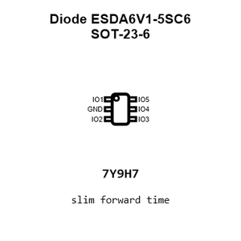

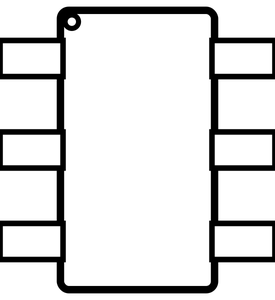

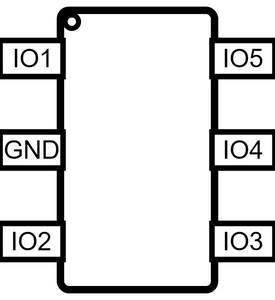

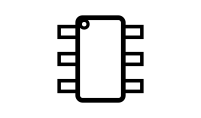

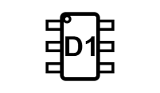

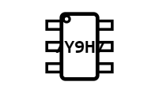

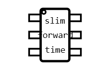

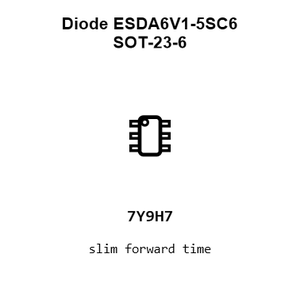

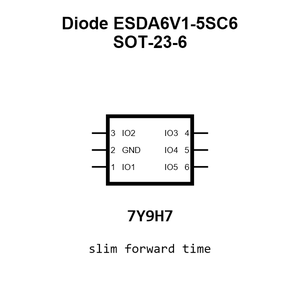

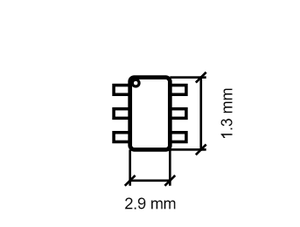

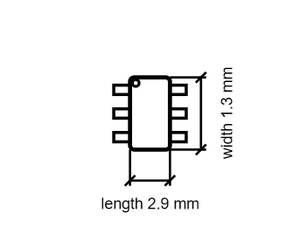

[View this part on GitHub](https://github.com/oomlout/oomp_electronic_version_5/tree/main/parts/electronic_diode_tvs_array_sot_23_6_stmicroelectronics_esda6v1_5sc6)

[Browse this category](../../navigation/electronic/diode/tvs_array/sot_23_6/stmicroelectronics/README.md)

---

This page is generated from the OOMP part definition by a Roboclick Jinja template. Edit the source taxonomy or template rather than this generated file.