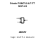
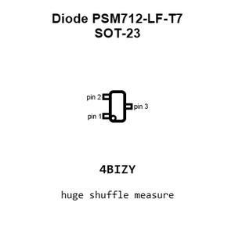
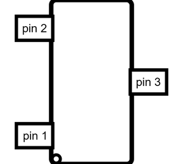
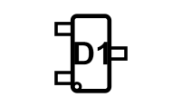
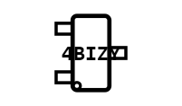
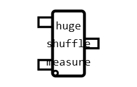
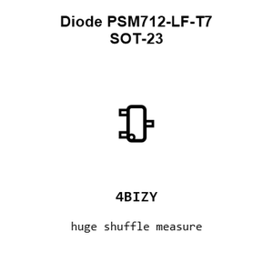
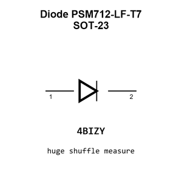
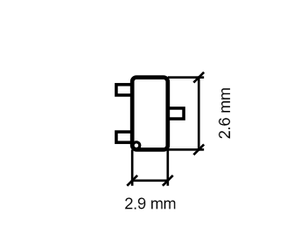
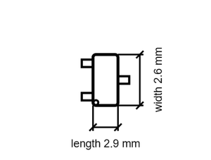

# Diode PSM712-LF-T7 SOT-23

`electronic_diode_tvs_array_sot_23_protek_psm712_lf_t7`

Diode PSM712-LF-T7 SOT-23 is an OOMP electronic diode definition. It uses the sot 23 package or form factor. Its nominal drawing size is 2.9 &#x00D7; 2.6 mm.

## At a glance

| Detail | Value |
| --- | --- |
| OOMP ID | `electronic_diode_tvs_array_sot_23_protek_psm712_lf_t7` |
| Type | Diode |
| Package / style | sot 23 |
| Nominal size | 2.9 &#x00D7; 2.6 mm |

## Classification

| Level | Value |
| --- | --- |
| 1 | `electronic` |
| 2 | `diode` |
| 3 | `tvs_array` |
| 4 | `sot_23` |
| 14 | `protek` |
| 15 | `psm712_lf_t7` |

## Nominal dimensions

| Measurement | Value |
| --- | ---: |
| Length | 2.9 mm |
| Width | 2.6 mm |

## Identifiers

| Identifier | Value |
| --- | --- |
| Manufacturer part number | `PSM712-LF-T7` |
| LCSC | [`C32677`](https://www.lcsc.com/product-detail/C32677.html) |
| JLCPCB | [`C32677`](https://jlcpcb.com/partdetail/ProTekDevices-PSM712_LFT7/C32677) |

## Files

[KiCad symbol, machine-solder and hand-solder footprints](data/kicad/README.md) · [Availability and source masters](data/kicad/manifest.yaml)

[View this part on GitHub](https://github.com/oomlout/oomp_electronic_version_5/tree/main/parts/electronic_diode_tvs_array_sot_23_protek_psm712_lf_t7)

[Browse this category](../../navigation/electronic/diode/tvs_array/sot_23/protek/README.md)

---

This page is generated from the OOMP part definition by a Roboclick Jinja template. Edit the source taxonomy or template rather than this generated file.