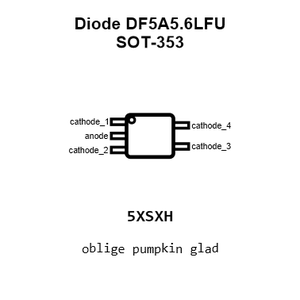
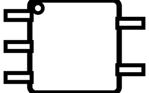
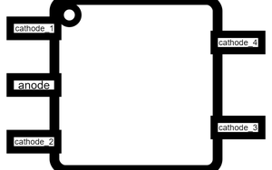
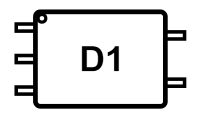
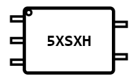
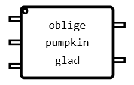
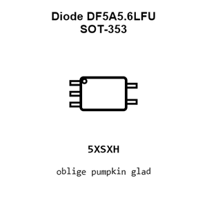
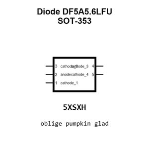
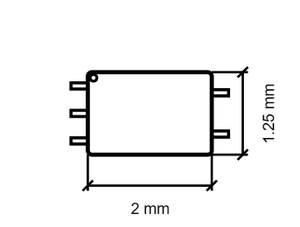
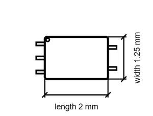

# Diode DF5A5.6LFU SOT-353

`electronic_diode_tvs_sot_353_toshiba_df5a5_6lfu`

Diode DF5A5.6LFU SOT-353 is an OOMP electronic diode definition. It uses the sot 353 package or form factor. Its nominal drawing size is 2.0 &#x00D7; 1.25 mm. The definition includes 5 documented pins.

## At a glance

| Detail | Value |
| --- | --- |
| OOMP ID | `electronic_diode_tvs_sot_353_toshiba_df5a5_6lfu` |
| Type | Diode |
| Package / style | sot 353 |
| Nominal size | 2.0 &#x00D7; 1.25 mm |
| Documented pins | 5 |

## Classification

| Level | Value |
| --- | --- |
| 1 | `electronic` |
| 2 | `diode` |
| 3 | `tvs` |
| 4 | `sot_353` |
| 14 | `toshiba` |
| 15 | `df5a5_6lfu` |

## Nominal dimensions

| Measurement | Value |
| --- | ---: |
| Length | 2.0 mm |
| Width | 1.25 mm |

## Identifiers

| Identifier | Value |
| --- | --- |
| Manufacturer part number | `DF5A5.6LFU` |
| LCSC | [`C5445`](https://www.lcsc.com/product-detail/C5445.html) |

## Pins

| Pin | Name | Type |
| ---: | --- | --- |
| 1 | cathode_1 | passive |
| 2 | anode | passive |
| 3 | cathode_2 | passive |
| 4 | cathode_3 | passive |
| 5 | cathode_4 | passive |

## Files

[KiCad symbol, machine-solder and hand-solder footprints](data/kicad/README.md) · [Availability and source masters](data/kicad/manifest.yaml)

[View this part on GitHub](https://github.com/oomlout/oomp_electronic_version_5/tree/main/parts/electronic_diode_tvs_sot_353_toshiba_df5a5_6lfu)

[Browse this category](../../navigation/electronic/diode/tvs/sot_353/toshiba/README.md)

---

This page is generated from the OOMP part definition by a Roboclick Jinja template. Edit the source taxonomy or template rather than this generated file.