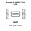
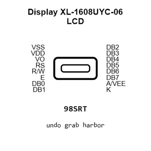
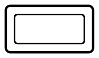
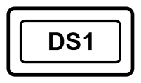
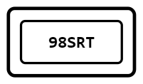
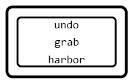
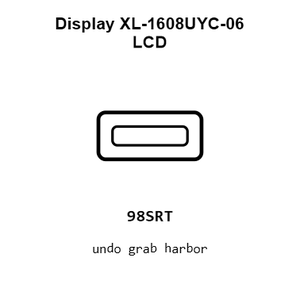
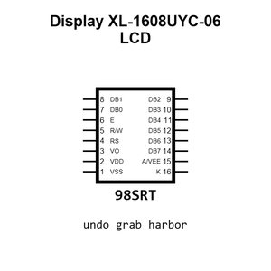
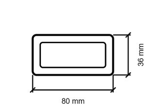
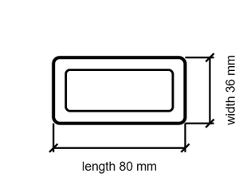

# Display XL-1608UYC-06 LCD

`electronic_display_lcd_character_16_by_2_backlight_yellow`

Display XL-1608UYC-06 LCD is an OOMP electronic display definition. It uses the lcd package or form factor. Its nominal drawing size is 80.0 &#x00D7; 36.0 mm. The definition includes 16 documented pins.

## At a glance

| Detail | Value |
| --- | --- |
| OOMP ID | `electronic_display_lcd_character_16_by_2_backlight_yellow` |
| Type | Display |
| Package / style | lcd |
| Nominal size | 80.0 &#x00D7; 36.0 mm |
| Documented pins | 16 |

## Classification

| Level | Value |
| --- | --- |
| 1 | `electronic` |
| 2 | `display` |
| 3 | `lcd` |
| 4 | `character` |
| 5 | `16_by_2` |
| 6 | `backlight_yellow` |

## Nominal dimensions

| Measurement | Value |
| --- | ---: |
| Length | 80.0 mm |
| Width | 36.0 mm |

## Identifiers

| Identifier | Value |
| --- | --- |
| Manufacturer part number | `XL-1608UYC-06` |
| LCSC | [`C965802`](https://www.lcsc.com/product-detail/C965802.html) |

## Pins

| Pin | Name | Type |
| ---: | --- | --- |
| 1 | VSS | power_in |
| 2 | VDD | power_in |
| 3 | VO | passive |
| 4 | RS | input |
| 5 | R/W | input |
| 6 | E | input |
| 7 | DB0 | bidirectional |
| 8 | DB1 | bidirectional |
| 9 | DB2 | bidirectional |
| 10 | DB3 | bidirectional |
| 11 | DB4 | bidirectional |
| 12 | DB5 | bidirectional |
| 13 | DB6 | bidirectional |
| 14 | DB7 | bidirectional |
| 15 | A/VEE | power_in |
| 16 | K | power_in |

## Files

[KiCad symbol, machine-solder and hand-solder footprints](data/kicad/README.md) · [Availability and source masters](data/kicad/manifest.yaml)

[View this part on GitHub](https://github.com/oomlout/oomp_electronic_version_5/tree/main/parts/electronic_display_lcd_character_16_by_2_backlight_yellow)

[Browse this category](../../navigation/electronic/display/lcd/character/16_by_2/README.md)

---

This page is generated from the OOMP part definition by a Roboclick Jinja template. Edit the source taxonomy or template rather than this generated file.