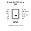
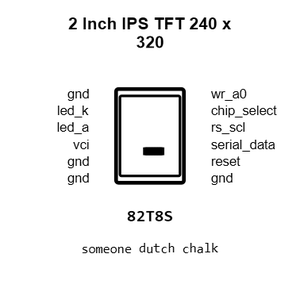
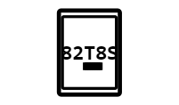
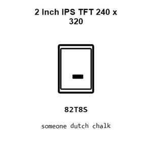
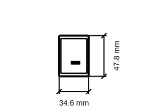
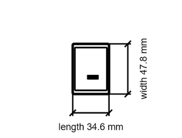

# 2 Inch IPS TFT 240 x 320

`electronic_display_tft_2_inch_240_x_320_pixel_ips_spi_12_pin_szhtc_qt200h1201`

2 Inch IPS TFT 240 x 320 is an OOMP electronic display definition. It uses the tft package or form factor. Its nominal drawing size is 34.6 &#x00D7; 47.8 mm. The definition includes 12 documented pins.

## At a glance

| Detail | Value |
| --- | --- |
| OOMP ID | `electronic_display_tft_2_inch_240_x_320_pixel_ips_spi_12_pin_szhtc_qt200h1201` |
| Type | Display |
| Package / style | tft |
| Nominal size | 34.6 &#x00D7; 47.8 mm |
| Documented pins | 12 |

## Classification

| Level | Value |
| --- | --- |
| 1 | `electronic` |
| 2 | `display` |
| 3 | `tft` |
| 4 | `2_inch` |
| 5 | `240_x_320_pixel` |
| 6 | `ips` |
| 7 | `spi` |
| 8 | `12_pin` |
| 14 | `szhtc` |
| 15 | `qt200h1201` |

## Nominal dimensions

| Measurement | Value |
| --- | ---: |
| Length | 34.6 mm |
| Width | 47.8 mm |

## Identifiers

| Identifier | Value |
| --- | --- |
| Manufacturer part number | `QT200H1201` |

## Pins

| Pin | Name | Type |
| ---: | --- | --- |
| 1 | gnd | power_in |
| 2 | led_k | power_in |
| 3 | led_a | power_in |
| 4 | vci | power_in |
| 5 | gnd | power_in |
| 6 | gnd | power_in |
| 7 | wr_a0 | input |
| 8 | chip_select | input |
| 9 | rs_scl | input |
| 10 | serial_data | input |
| 11 | reset | input |
| 12 | gnd | power_in |

## Datasheet

[View the datasheet](datasheet.pdf)

## Files

[View this part on GitHub](https://github.com/oomlout/oomp_electronic_version_5/tree/main/parts/electronic_display_tft_2_inch_240_x_320_pixel_ips_spi_12_pin_szhtc_qt200h1201)

---

This page is generated from the OOMP part definition by a Roboclick Jinja template. Edit the source taxonomy or template rather than this generated file.