# Ferrite Bead 220 Ohm 2 2 Amp Murata BLM18KG221SN1D 0603

`electronic_ferrite_bead_0603_220_ohm_2_2_amp_murata_blm18kg221sn1d`

Ferrite Bead 220 Ohm 2 2 Amp Murata BLM18KG221SN1D 0603 is an OOMP electronic ferrite bead definition. It uses the 0603 package or form factor. Its nominal drawing size is 1.6 &#x00D7; 0.8 mm. The definition includes 2 documented pins.

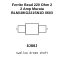

## At a glance

| Detail | Value |
| --- | --- |
| OOMP ID | `electronic_ferrite_bead_0603_220_ohm_2_2_amp_murata_blm18kg221sn1d` |
| Type | Ferrite Bead |
| Package / style | 0603 |
| Nominal size | 1.6 &#x00D7; 0.8 mm |
| Documented pins | 2 |

## Classification

| Level | Value |
| --- | --- |
| 1 | `electronic` |
| 2 | `ferrite_bead` |
| 3 | `0603` |
| 4 | `220_ohm` |
| 5 | `2_2_amp` |
| 14 | `murata` |
| 15 | `blm18kg221sn1d` |

## Nominal dimensions

| Measurement | Value |
| --- | ---: |
| Length | 1.6 mm |
| Width | 0.8 mm |

## Pins

| Pin | Name | Type |
| ---: | --- | --- |
| 1 | 1 | signal |
| 2 | 2 | signal |

## Used in projects

| Project | Quantity | References | Explore |
| --- | ---: | --- | --- |
| [Project electrolama/TinyReflowController Tiny Reflow Controller current](https://github.com/electrolama/TinyReflowController/tree/master/hardware/Revision%20A1) | 1 | L1 | [Board explorer](https://oomlout.github.io/oomp_electronic_version_5/parts/oomp_project_github_electrolama_tiny_reflow_controller_tiny_reflow_controller_current/board_explorer.html) · [OOMP project](https://github.com/oomlout/oomp_electronic_version_5/tree/main/parts/oomp_project_github_electrolama_tiny_reflow_controller_tiny_reflow_controller_current) |

## Files

[KiCad symbol, machine-solder and hand-solder footprints](data/kicad/README.md) · [Availability and source masters](data/kicad/manifest.yaml)

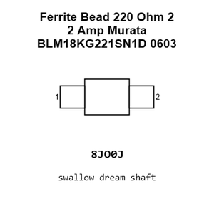

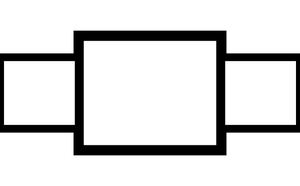

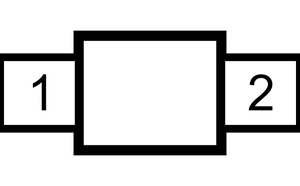

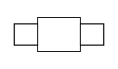

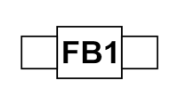

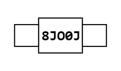

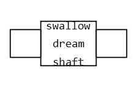

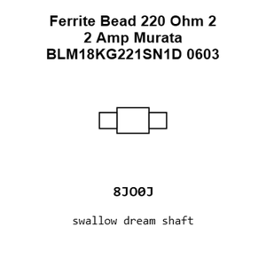

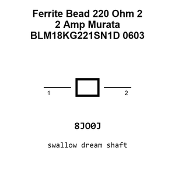

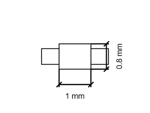

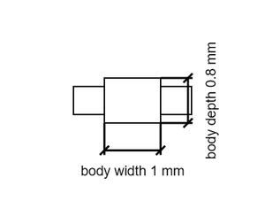

[View this part on GitHub](https://github.com/oomlout/oomp_electronic_version_5/tree/main/parts/electronic_ferrite_bead_0603_220_ohm_2_2_amp_murata_blm18kg221sn1d)

[Browse this category](../../navigation/electronic/ferrite_bead/0603/220_ohm/2_2_amp/murata/README.md)

---

This page is generated from the OOMP part definition by a Roboclick Jinja template. Edit the source taxonomy or template rather than this generated file.