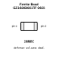
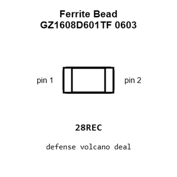
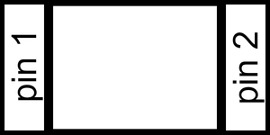
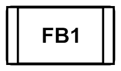
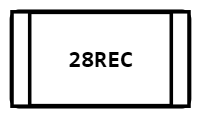
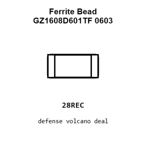
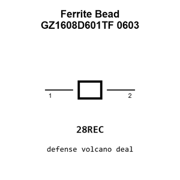

# Ferrite Bead GZ1608D601TF 0603

`electronic_ferrite_bead_0603_600_ohm_200_milliamp_sunlord_gz1608d601tf`

Ferrite Bead GZ1608D601TF 0603 is an OOMP electronic ferrite bead definition. It uses the 0603 package or form factor. Its nominal drawing size is 1.6 &#x00D7; 0.8 mm.

## At a glance

| Detail | Value |
| --- | --- |
| OOMP ID | `electronic_ferrite_bead_0603_600_ohm_200_milliamp_sunlord_gz1608d601tf` |
| Type | Ferrite Bead |
| Package / style | 0603 |
| Nominal size | 1.6 &#x00D7; 0.8 mm |

## Classification

| Level | Value |
| --- | --- |
| 1 | `electronic` |
| 2 | `ferrite_bead` |
| 3 | `0603` |
| 4 | `600_ohm` |
| 5 | `200_milliamp` |
| 14 | `sunlord` |
| 15 | `gz1608d601tf` |

## Nominal dimensions

| Measurement | Value |
| --- | ---: |
| Length | 1.6 mm |
| Width | 0.8 mm |

## Identifiers

| Identifier | Value |
| --- | --- |
| Manufacturer part number | `GZ1608D601TF` |
| LCSC | [`C1002`](https://www.lcsc.com/product-detail/C1002.html) |
| JLCPCB | [`C1002`](https://jlcpcb.com/partdetail/Sunlord-GZ1608D601TF/C1002) |

## Files

[KiCad symbol, machine-solder and hand-solder footprints](data/kicad/README.md) · [Availability and source masters](data/kicad/manifest.yaml)

[View this part on GitHub](https://github.com/oomlout/oomp_electronic_version_5/tree/main/parts/electronic_ferrite_bead_0603_600_ohm_200_milliamp_sunlord_gz1608d601tf)

[Browse this category](../../navigation/electronic/ferrite_bead/0603/600_ohm/200_milliamp/sunlord/README.md)

---

This page is generated from the OOMP part definition by a Roboclick Jinja template. Edit the source taxonomy or template rather than this generated file.