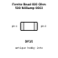
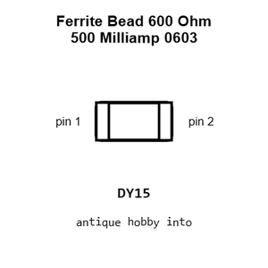
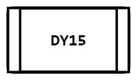
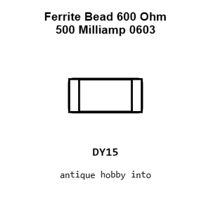
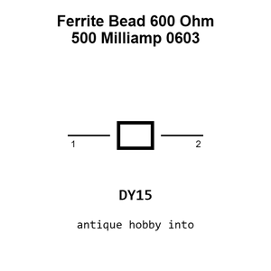

# Ferrite Bead 600 Ohm 500 Milliamp 0603

`electronic_ferrite_bead_0603_600_ohm_500_milliamp`

Ferrite Bead 600 Ohm 500 Milliamp 0603 is an OOMP electronic ferrite bead definition. It uses the 0603 package or form factor. Its nominal drawing size is 1.6 &#x00D7; 0.8 mm.

## At a glance

| Detail | Value |
| --- | --- |
| OOMP ID | `electronic_ferrite_bead_0603_600_ohm_500_milliamp` |
| Type | Ferrite Bead |
| Package / style | 0603 |
| Nominal size | 1.6 &#x00D7; 0.8 mm |

## Classification

| Level | Value |
| --- | --- |
| 1 | `electronic` |
| 2 | `ferrite_bead` |
| 3 | `0603` |
| 4 | `600_ohm` |
| 5 | `500_milliamp` |

## Nominal dimensions

| Measurement | Value |
| --- | ---: |
| Length | 1.6 mm |
| Width | 0.8 mm |

## Used in projects

| Project | Quantity | References | Explore |
| --- | ---: | --- | --- |
| [Project adafruit/Adafruit-ADS122C04-24-Bit-ADC-PCB Adafruit ADS122 C04 24 Bit ADC current](https://github.com/adafruit/Adafruit-ADS122C04-24-Bit-ADC-PCB/blob/main/Adafruit%20ADS122C04%2024-Bit%20ADC.brd) | 2 | FB3, FB4 | [Board explorer](https://oomlout.github.io/oomp_electronic_version_5/parts/oomp_project_github_adafruit_adafruit_ads122_c04_24_bit_adc_pcb_adafruit_ads122_c04_24_bit_adc_current/board_explorer.html) · [OOMP project](https://github.com/oomlout/oomp_electronic_version_5/tree/main/parts/oomp_project_github_adafruit_adafruit_ads122_c04_24_bit_adc_pcb_adafruit_ads122_c04_24_bit_adc_current) |
| [Project adafruit/Adafruit-MAX98357-I2S-Amp-Breakout Adafruit MAX98357 Breakout Stereo current](https://github.com/adafruit/Adafruit-MAX98357-I2S-Amp-Breakout/blob/master/Adafruit%20MAX98357%20Breakout%20-%20Stereo%20rev%20B.brd) | 4 | FB1, FB2, FB3, FB4 | [Board explorer](https://oomlout.github.io/oomp_electronic_version_5/parts/oomp_project_github_adafruit_adafruit_max98357_i2_s_amp_breakout_adafruit_max98357_breakout_stereo_current/board_explorer.html) · [OOMP project](https://github.com/oomlout/oomp_electronic_version_5/tree/main/parts/oomp_project_github_adafruit_adafruit_max98357_i2_s_amp_breakout_adafruit_max98357_breakout_stereo_current) |
| [Project adafruit/Adafruit-MEMENTO-PCB Adafruit MEMENTO Camera Board current](https://github.com/adafruit/Adafruit-MEMENTO-PCB/blob/main/Adafruit%20MEMENTO%20Camera%20Board.brd) | 1 | FB1 | [Board explorer](https://oomlout.github.io/oomp_electronic_version_5/parts/oomp_project_github_adafruit_adafruit_memento_pcb_adafruit_memento_camera_board_current/board_explorer.html) · [OOMP project](https://github.com/oomlout/oomp_electronic_version_5/tree/main/parts/oomp_project_github_adafruit_adafruit_memento_pcb_adafruit_memento_camera_board_current) |
| [Project adafruit/Adafruit-OV5640-Camera-Breakout-PCB Adafruit OV5640 Breakout current](https://github.com/adafruit/Adafruit-OV5640-Camera-Breakout-PCB/blob/main/Adafruit%20OV5640%20Breakout.brd) | 1 | FB1 | [Board explorer](https://oomlout.github.io/oomp_electronic_version_5/parts/oomp_project_github_adafruit_adafruit_ov5640_camera_breakout_pcb_adafruit_ov5640_breakout_current/board_explorer.html) · [OOMP project](https://github.com/oomlout/oomp_electronic_version_5/tree/main/parts/oomp_project_github_adafruit_adafruit_ov5640_camera_breakout_pcb_adafruit_ov5640_breakout_current) |
| [Project soldered_electronics/Thermocouple-sensor-AD8495-breakout-hardware-design AD8495 Breakout current](https://github.com/SolderedElectronics/Thermocouple-sensor-AD8495-breakout-hardware-design) | 1 | L1 | [Board explorer](https://oomlout.github.io/oomp_electronic_version_5/parts/oomp_project_github_soldered_electronics_thermocouple_sensor_ad8495_breakout_hardware_design_sensor_thermocouple_ad8495_current/board_explorer.html) · [OOMP project](https://github.com/oomlout/oomp_electronic_version_5/tree/main/parts/oomp_project_github_soldered_electronics_thermocouple_sensor_ad8495_breakout_hardware_design_sensor_thermocouple_ad8495_current) |

## Files

[KiCad symbol, machine-solder and hand-solder footprints](data/kicad/README.md) · [Availability and source masters](data/kicad/manifest.yaml)

[View this part on GitHub](https://github.com/oomlout/oomp_electronic_version_5/tree/main/parts/electronic_ferrite_bead_0603_600_ohm_500_milliamp)

[Browse this category](../../navigation/electronic/ferrite_bead/0603/600_ohm/README.md)

---

This page is generated from the OOMP part definition by a Roboclick Jinja template. Edit the source taxonomy or template rather than this generated file.