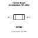
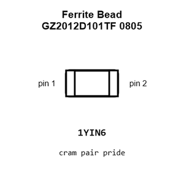
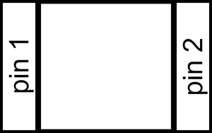
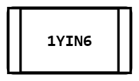
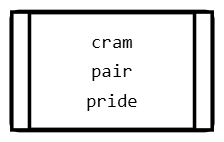
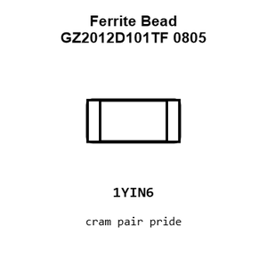
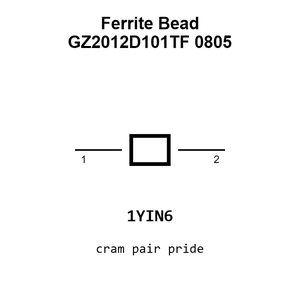

# Ferrite Bead GZ2012D101TF 0805

`electronic_ferrite_bead_0805_100_ohm_800_milliamp_sunlord_gz2012d101tf`

Ferrite Bead GZ2012D101TF 0805 is an OOMP electronic ferrite bead definition. It uses the 0805 package or form factor. Its nominal drawing size is 2.0 &#x00D7; 1.25 mm. The definition includes 2 documented pins.

## At a glance

| Detail | Value |
| --- | --- |
| OOMP ID | `electronic_ferrite_bead_0805_100_ohm_800_milliamp_sunlord_gz2012d101tf` |
| Type | Ferrite Bead |
| Package / style | 0805 |
| Nominal size | 2.0 &#x00D7; 1.25 mm |
| Documented pins | 2 |

## Classification

| Level | Value |
| --- | --- |
| 1 | `electronic` |
| 2 | `ferrite_bead` |
| 3 | `0805` |
| 4 | `100_ohm` |
| 5 | `800_milliamp` |
| 14 | `sunlord` |
| 15 | `gz2012d101tf` |

## Nominal dimensions

| Measurement | Value |
| --- | ---: |
| Height | 0.85 mm |
| Length | 2.0 mm |
| Width | 1.25 mm |

## Identifiers

| Identifier | Value |
| --- | --- |
| Manufacturer part number | `GZ2012D101TF` |
| LCSC | [`C1015`](https://www.lcsc.com/product-detail/C1015.html) |
| JLCPCB | [`C1015`](https://jlcpcb.com/partdetail/Sunlord-GZ2012D101TF/C1015) |

## Pins

| Pin | Name | Type |
| ---: | --- | --- |
| 1 | terminal_1 | passive |
| 2 | terminal_2 | passive |

## Datasheet

[View the datasheet](data/datasheet.pdf)

## Files

[KiCad symbol, machine-solder and hand-solder footprints](data/kicad/README.md) · [Availability and source masters](data/kicad/manifest.yaml)

[View this part on GitHub](https://github.com/oomlout/oomp_electronic_version_5/tree/main/parts/electronic_ferrite_bead_0805_100_ohm_800_milliamp_sunlord_gz2012d101tf)

[Browse this category](../../navigation/electronic/ferrite_bead/0805/100_ohm/800_milliamp/sunlord/README.md)

---

This page is generated from the OOMP part definition by a Roboclick Jinja template. Edit the source taxonomy or template rather than this generated file.