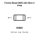
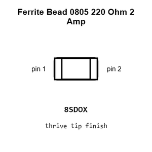
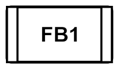
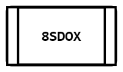
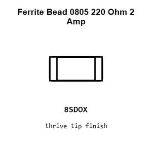
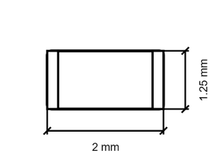
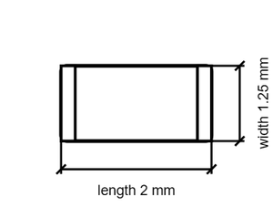

# Ferrite Bead 0805 220 Ohm 2 Amp

`electronic_ferrite_bead_0805_220_ohm_2_amp_murata_blm21pg221sn1d`

Ferrite Bead 0805 220 Ohm 2 Amp is an OOMP electronic ferrite bead definition. It uses the 0805 package or form factor. Its nominal drawing size is 2.0 × 1.25 mm.

## At a glance

| Detail | Value |
| --- | --- |
| OOMP ID | `electronic_ferrite_bead_0805_220_ohm_2_amp_murata_blm21pg221sn1d` |
| Type | Ferrite Bead |
| Package / style | 0805 |
| Nominal size | 2.0 × 1.25 mm |

## Classification

| Level | Value |
| --- | --- |
| 1 | `electronic` |
| 2 | `ferrite_bead` |
| 3 | `0805` |
| 4 | `220_ohm` |
| 5 | `2_amp` |
| 14 | `murata` |
| 15 | `blm21pg221sn1d` |

## Nominal dimensions

| Measurement | Value |
| --- | ---: |
| Length | 2.0 mm |
| Width | 1.25 mm |

## Identifiers

| Identifier | Value |
| --- | --- |
| Manufacturer part number | `BLM21PG221SN1D` |
| LCSC | `C85840` |

## Files

[View this part on GitHub](https://github.com/oomlout/oomp_electronic_version_5/tree/main/parts/electronic_ferrite_bead_0805_220_ohm_2_amp_murata_blm21pg221sn1d)

---

This page is generated from the OOMP part definition by a Roboclick Jinja template. Edit the source taxonomy or template rather than this generated file.
