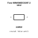
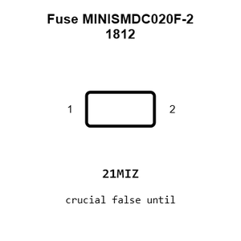
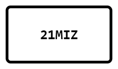
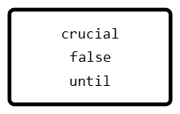
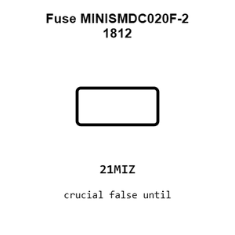
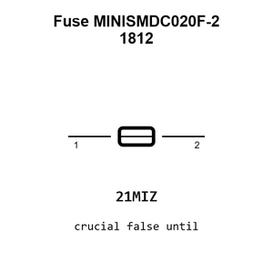
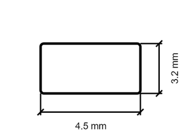
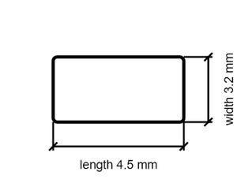

# Fuse MINISMDC020F-2 1812

`electronic_fuse_1812_resettable_littelfuse_minismdc020f_2`

Fuse MINISMDC020F-2 1812 is an OOMP electronic fuse definition. It uses the 1812 package or form factor. Its nominal drawing size is 4.5 &#x00D7; 3.2 mm. The definition includes 2 documented pins.

## At a glance

| Detail | Value |
| --- | --- |
| OOMP ID | `electronic_fuse_1812_resettable_littelfuse_minismdc020f_2` |
| Type | Fuse |
| Package / style | 1812 |
| Nominal size | 4.5 &#x00D7; 3.2 mm |
| Documented pins | 2 |

## Classification

| Level | Value |
| --- | --- |
| 1 | `electronic` |
| 2 | `fuse` |
| 3 | `1812` |
| 4 | `resettable` |
| 14 | `littelfuse` |
| 15 | `minismdc020f_2` |

## Nominal dimensions

| Measurement | Value |
| --- | ---: |
| Height | 2.4 mm |
| Length | 4.5 mm |
| Width | 3.2 mm |

## Identifiers

| Identifier | Value |
| --- | --- |
| Manufacturer part number | `MINISMDC020F-2` |
| LCSC | [`C5418`](https://www.lcsc.com/product-detail/C5418.html) |
| JLCPCB | [`C5418`](https://jlcpcb.com/partdetail/Littelfuse-MINISMDC020F2/C5418) |

## Pins

| Pin | Name | Type |
| ---: | --- | --- |
| 1 | 1 | passive |
| 2 | 2 | passive |

## Datasheet

[View the datasheet](data/datasheet.pdf)

## Files

[KiCad symbol, machine-solder and hand-solder footprints](data/kicad/README.md) · [Availability and source masters](data/kicad/manifest.yaml)

[View this part on GitHub](https://github.com/oomlout/oomp_electronic_version_5/tree/main/parts/electronic_fuse_1812_resettable_littelfuse_minismdc020f_2)

[Browse this category](../../navigation/electronic/fuse/1812/resettable/littelfuse/README.md)

---

This page is generated from the OOMP part definition by a Roboclick Jinja template. Edit the source taxonomy or template rather than this generated file.