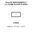
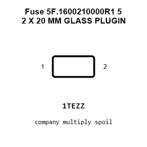
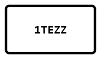
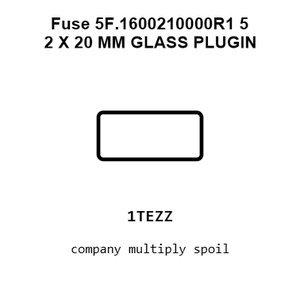
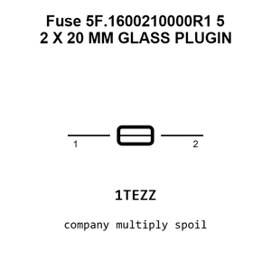
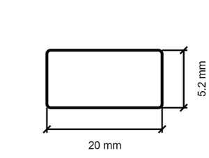
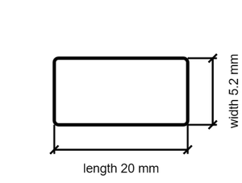

# Fuse 5F.1600210000R1 5 2 X 20 MM GLASS PLUGIN

`electronic_fuse_5_2_x_20_mm_glass_plugin_disposable_xucheng_elec_5f_1600210000r1`

Fuse 5F.1600210000R1 5 2 X 20 MM GLASS PLUGIN is an OOMP electronic fuse definition. It uses the 5 2 x 20 mm glass plugin package or form factor. Its nominal drawing size is 20.0 &#x00D7; 5.2 mm. The definition includes 2 documented pins.

## At a glance

| Detail | Value |
| --- | --- |
| OOMP ID | `electronic_fuse_5_2_x_20_mm_glass_plugin_disposable_xucheng_elec_5f_1600210000r1` |
| Type | Fuse |
| Package / style | 5 2 x 20 mm glass plugin |
| Nominal size | 20.0 &#x00D7; 5.2 mm |
| Documented pins | 2 |

## Classification

| Level | Value |
| --- | --- |
| 1 | `electronic` |
| 2 | `fuse` |
| 3 | `5_2_x_20_mm_glass_plugin` |
| 4 | `disposable` |
| 14 | `xucheng_elec` |
| 15 | `5f_1600210000r1` |

## Nominal dimensions

| Measurement | Value |
| --- | ---: |
| Height | 6.5 mm |
| Length | 20.0 mm |
| Width | 5.2 mm |

## Identifiers

| Identifier | Value |
| --- | --- |
| Manufacturer part number | `5F.1600210000R1` |
| LCSC | [`C3124`](https://www.lcsc.com/product-detail/C3124.html) |
| JLCPCB | [`C3124`](https://jlcpcb.com/partdetail/XuchengElec-5F1600210000R1/C3124) |

## Pins

| Pin | Name | Type |
| ---: | --- | --- |
| 1 | 1 | passive |
| 2 | 2 | passive |

## Datasheet

[View the datasheet](data/datasheet.pdf)

## Files

[KiCad symbol, machine-solder and hand-solder footprints](data/kicad/README.md) · [Availability and source masters](data/kicad/manifest.yaml)

[View this part on GitHub](https://github.com/oomlout/oomp_electronic_version_5/tree/main/parts/electronic_fuse_5_2_x_20_mm_glass_plugin_disposable_xucheng_elec_5f_1600210000r1)

[Browse this category](../../navigation/electronic/fuse/5_2_x_20_mm_glass_plugin/disposable/xucheng_elec/README.md)

---

This page is generated from the OOMP part definition by a Roboclick Jinja template. Edit the source taxonomy or template rather than this generated file.