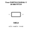
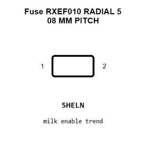
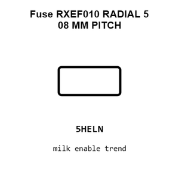
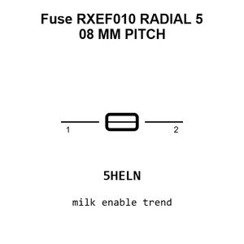
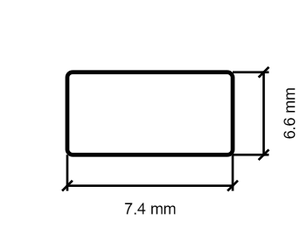
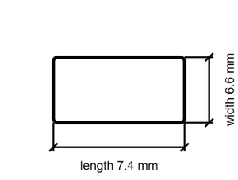

# Fuse RXEF010 RADIAL 5 08 MM PITCH

`electronic_fuse_radial_5_08_mm_pitch_resettable_littelfuse_rxef010`

Fuse RXEF010 RADIAL 5 08 MM PITCH is an OOMP electronic fuse definition. It uses the radial 5 08 mm pitch package or form factor. Its nominal drawing size is 7.4 &#x00D7; 6.6 mm. The definition includes 2 documented pins.

## At a glance

| Detail | Value |
| --- | --- |
| OOMP ID | `electronic_fuse_radial_5_08_mm_pitch_resettable_littelfuse_rxef010` |
| Type | Fuse |
| Package / style | radial 5 08 mm pitch |
| Nominal size | 7.4 &#x00D7; 6.6 mm |
| Documented pins | 2 |

## Classification

| Level | Value |
| --- | --- |
| 1 | `electronic` |
| 2 | `fuse` |
| 3 | `radial_5_08_mm_pitch` |
| 4 | `resettable` |
| 14 | `littelfuse` |
| 15 | `rxef010` |

## Nominal dimensions

| Measurement | Value |
| --- | ---: |
| Height | 3.0 mm |
| Length | 7.4 mm |
| Width | 6.6 mm |

## Identifiers

| Identifier | Value |
| --- | --- |
| Manufacturer part number | `RXEF010` |
| LCSC | [`C5392`](https://www.lcsc.com/product-detail/C5392.html) |
| JLCPCB | [`C5392`](https://jlcpcb.com/partdetail/Littelfuse-RXEF010/C5392) |

## Pins

| Pin | Name | Type |
| ---: | --- | --- |
| 1 | 1 | passive |
| 2 | 2 | passive |

## Datasheet

[View the datasheet](data/datasheet.pdf)

## Files

[KiCad symbol, machine-solder and hand-solder footprints](data/kicad/README.md) · [Availability and source masters](data/kicad/manifest.yaml)

[View this part on GitHub](https://github.com/oomlout/oomp_electronic_version_5/tree/main/parts/electronic_fuse_radial_5_08_mm_pitch_resettable_littelfuse_rxef010)

[Browse this category](../../navigation/electronic/fuse/radial_5_08_mm_pitch/resettable/littelfuse/README.md)

---

This page is generated from the OOMP part definition by a Roboclick Jinja template. Edit the source taxonomy or template rather than this generated file.