# IC Power Management Linear Voltage Regulator Diodes DFN_8

`electronic_ic_dfn_8_power_management_linear_voltage_regulator_diodes_ap7361c_3_3v`

IC Power Management Linear Voltage Regulator Diodes DFN_8 is an OOMP electronic ic definition. It uses the dfn 8 package or form factor. Its nominal drawing size is 3.0 &#x00D7; 3.0 mm. The definition includes 8 documented pins.

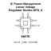

## At a glance

| Detail | Value |
| --- | --- |
| OOMP ID | `electronic_ic_dfn_8_power_management_linear_voltage_regulator_diodes_ap7361c_3_3v` |
| Type | Ic |
| Package / style | dfn 8 |
| Nominal size | 3.0 &#x00D7; 3.0 mm |
| Documented pins | 8 |

## Classification

| Level | Value |
| --- | --- |
| 1 | `electronic` |
| 2 | `ic` |
| 3 | `dfn_8` |
| 4 | `power_management` |
| 5 | `linear_voltage_regulator` |
| 14 | `diodes` |
| 15 | `ap7361c_3_3v` |

## Nominal dimensions

| Measurement | Value |
| --- | ---: |
| Height | 0.8 mm |
| Length | 3.0 mm |
| Width | 3.0 mm |

## Pins

| Pin | Name | Type |
| ---: | --- | --- |
| 1 | OUT | signal |
| 2 | NC | no_connect |
| 3 | ADJ_NC | signal |
| 4 | GND | gnd |
| 5 | EN | signal |
| 6 | NC | no_connect |
| 7 | NC | no_connect |
| 8 | IN | signal |

## Files

[KiCad symbol, machine-solder and hand-solder footprints](data/kicad/README.md) · [Availability and source masters](data/kicad/manifest.yaml)

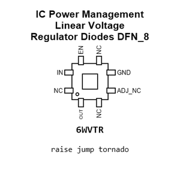

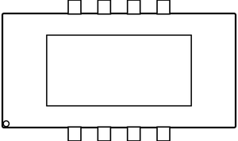

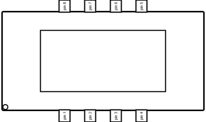

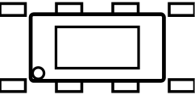

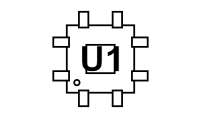

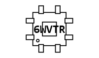

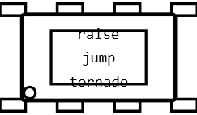

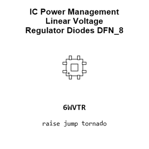

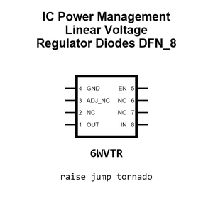

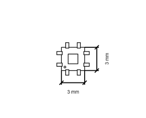

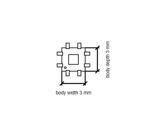

[View this part on GitHub](https://github.com/oomlout/oomp_electronic_version_5/tree/main/parts/electronic_ic_dfn_8_power_management_linear_voltage_regulator_diodes_ap7361c_3_3v)

[Browse this category](../../navigation/electronic/ic/dfn_8/power_management/linear_voltage_regulator/diodes/README.md)

---

This page is generated from the OOMP part definition by a Roboclick Jinja template. Edit the source taxonomy or template rather than this generated file.