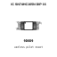
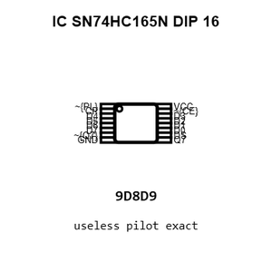
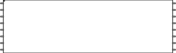
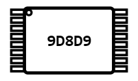
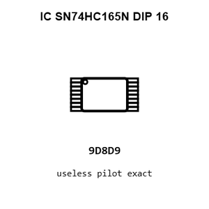
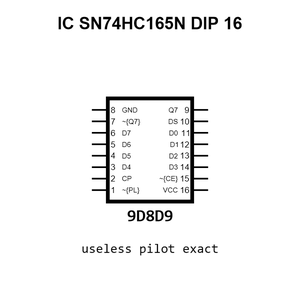
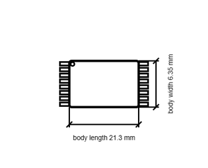

# IC SN74HC165N DIP 16

`electronic_ic_dip_16_logic_parallel_in_serial_out_shift_register_texas_instruments_sn74hc165n`

IC SN74HC165N DIP 16 is an OOMP electronic ic definition. It uses the dip 16 package or form factor. Its nominal drawing size is 21.3 &#x00D7; 6.35 mm. The definition includes 16 documented pins.

## At a glance

| Detail | Value |
| --- | --- |
| OOMP ID | `electronic_ic_dip_16_logic_parallel_in_serial_out_shift_register_texas_instruments_sn74hc165n` |
| Type | Ic |
| Package / style | dip 16 |
| Nominal size | 21.3 &#x00D7; 6.35 mm |
| Documented pins | 16 |

## Classification

| Level | Value |
| --- | --- |
| 1 | `electronic` |
| 2 | `ic` |
| 3 | `dip_16` |
| 4 | `logic` |
| 5 | `parallel_in_serial_out_shift_register` |
| 14 | `texas_instruments` |
| 15 | `sn74hc165n` |

## Nominal dimensions

| Measurement | Value |
| --- | ---: |
| Height | 3.3 mm |
| Length | 21.3 mm |
| Width | 6.35 mm |

## Identifiers

| Identifier | Value |
| --- | --- |
| Manufacturer part number | `SN74HC165N` |
| LCSC | [`C2909`](https://www.lcsc.com/product-detail/C2909.html) |
| JLCPCB | [`C2909`](https://jlcpcb.com/partdetail/TexasInstruments-SN74HC165N/C2909) |

## Pins

| Pin | Name | Type |
| ---: | --- | --- |
| 1 | ~{PL} | in |
| 2 | CP | in |
| 3 | D4 | in |
| 4 | D5 | in |
| 5 | D6 | in |
| 6 | D7 | in |
| 7 | ~{Q7} | out |
| 8 | GND | pwr |
| 9 | Q7 | out |
| 10 | DS | in |
| 11 | D0 | in |
| 12 | D1 | in |
| 13 | D2 | in |
| 14 | D3 | in |
| 15 | ~{CE} | in |
| 16 | VCC | pwr |

## Datasheet

[View the datasheet](data/datasheet.pdf)

## Files

[KiCad symbol, machine-solder and hand-solder footprints](data/kicad/README.md) · [Availability and source masters](data/kicad/manifest.yaml)

[View this part on GitHub](https://github.com/oomlout/oomp_electronic_version_5/tree/main/parts/electronic_ic_dip_16_logic_parallel_in_serial_out_shift_register_texas_instruments_sn74hc165n)

[Browse this category](../../navigation/electronic/ic/dip_16/logic/parallel_in_serial_out_shift_register/texas_instruments/README.md)

---

This page is generated from the OOMP part definition by a Roboclick Jinja template. Edit the source taxonomy or template rather than this generated file.