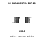
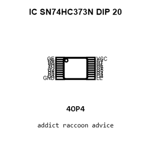
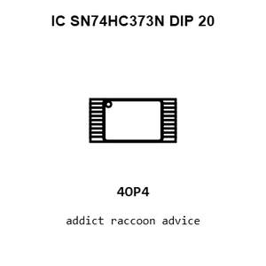
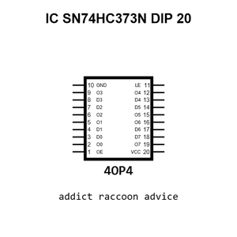
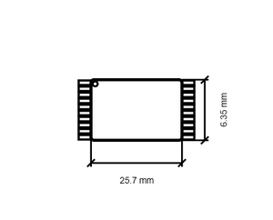
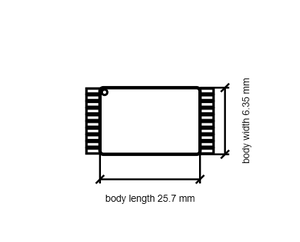

# IC SN74HC373N DIP 20

`electronic_ic_dip_20_logic_octal_d_type_transparent_latch_tri_state_texas_instruments_sn74hc373n`

IC SN74HC373N DIP 20 is an OOMP electronic ic definition. It uses the dip 20 package or form factor. Its nominal drawing size is 25.7 &#x00D7; 6.35 mm. The definition includes 20 documented pins.

## At a glance

| Detail | Value |
| --- | --- |
| OOMP ID | `electronic_ic_dip_20_logic_octal_d_type_transparent_latch_tri_state_texas_instruments_sn74hc373n` |
| Type | Ic |
| Package / style | dip 20 |
| Nominal size | 25.7 &#x00D7; 6.35 mm |
| Documented pins | 20 |

## Classification

| Level | Value |
| --- | --- |
| 1 | `electronic` |
| 2 | `ic` |
| 3 | `dip_20` |
| 4 | `logic` |
| 5 | `octal_d_type_transparent_latch_tri_state` |
| 14 | `texas_instruments` |
| 15 | `sn74hc373n` |

## Nominal dimensions

| Measurement | Value |
| --- | ---: |
| Height | 3.3 mm |
| Length | 25.7 mm |
| Width | 6.35 mm |

## Identifiers

| Identifier | Value |
| --- | --- |
| Manufacturer part number | `SN74HC373N` |
| LCSC | [`C2885`](https://www.lcsc.com/product-detail/C2885.html) |
| JLCPCB | [`C2885`](https://jlcpcb.com/partdetail/TexasInstruments-SN74HC373N/C2885) |

## Pins

| Pin | Name | Type |
| ---: | --- | --- |
| 1 | OE | in |
| 2 | O0 | ts |
| 3 | D0 | in |
| 4 | D1 | in |
| 5 | O1 | ts |
| 6 | O2 | ts |
| 7 | D2 | in |
| 8 | D3 | in |
| 9 | O3 | ts |
| 10 | GND | pwr |
| 11 | LE | in |
| 12 | O4 | ts |
| 13 | D4 | in |
| 14 | D5 | in |
| 15 | O5 | ts |
| 16 | O6 | ts |
| 17 | D6 | in |
| 18 | D7 | in |
| 19 | O7 | ts |
| 20 | VCC | pwr |

## Datasheet

[View the datasheet](data/datasheet.pdf)

## Files

[KiCad symbol, machine-solder and hand-solder footprints](data/kicad/README.md) · [Availability and source masters](data/kicad/manifest.yaml)

[View this part on GitHub](https://github.com/oomlout/oomp_electronic_version_5/tree/main/parts/electronic_ic_dip_20_logic_octal_d_type_transparent_latch_tri_state_texas_instruments_sn74hc373n)

[Browse this category](../../navigation/electronic/ic/dip_20/logic/octal_d_type_transparent_latch_tri_state/texas_instruments/README.md)

---

This page is generated from the OOMP part definition by a Roboclick Jinja template. Edit the source taxonomy or template rather than this generated file.