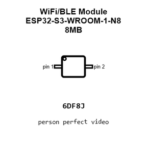
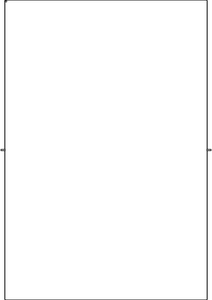
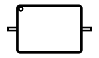
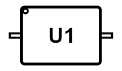
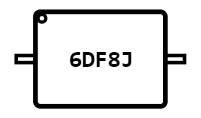
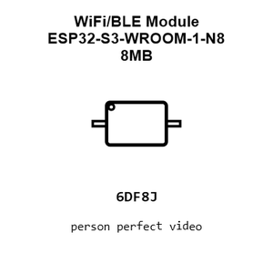
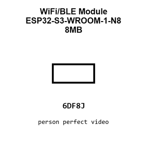
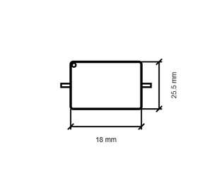
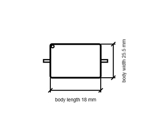

# WiFi/BLE Module ESP32-S3-WROOM-1-N8 8MB

`electronic_ic_esp32_s3_wroom_1_microcontroller_wifi_bluetooth_8_mb_flash_espressif_esp32_s3_wroom_1_n8`

WiFi/BLE Module ESP32-S3-WROOM-1-N8 8MB is an OOMP electronic ic definition. It uses the esp32 s3 wroom 1 package or form factor. Its nominal drawing size is 18.0 &#x00D7; 25.5 mm.

## At a glance

| Detail | Value |
| --- | --- |
| OOMP ID | `electronic_ic_esp32_s3_wroom_1_microcontroller_wifi_bluetooth_8_mb_flash_espressif_esp32_s3_wroom_1_n8` |
| Type | Ic |
| Package / style | esp32 s3 wroom 1 |
| Nominal size | 18.0 &#x00D7; 25.5 mm |

## Classification

| Level | Value |
| --- | --- |
| 1 | `electronic` |
| 2 | `ic` |
| 3 | `esp32_s3_wroom_1` |
| 4 | `microcontroller` |
| 5 | `wifi_bluetooth_8_mb_flash` |
| 14 | `espressif` |
| 15 | `esp32_s3_wroom_1_n8` |

## Nominal dimensions

| Measurement | Value |
| --- | ---: |
| Height | 3.1 mm |
| Length | 18.0 mm |
| Width | 25.5 mm |

## Identifiers

| Identifier | Value |
| --- | --- |
| Manufacturer part number | `ESP32-S3-WROOM-1-N8` |
| LCSC | [`C2913198`](https://www.lcsc.com/product-detail/C2913198.html) |

## Files

[KiCad symbol, machine-solder and hand-solder footprints](data/kicad/README.md) · [Availability and source masters](data/kicad/manifest.yaml)

[View this part on GitHub](https://github.com/oomlout/oomp_electronic_version_5/tree/main/parts/electronic_ic_esp32_s3_wroom_1_microcontroller_wifi_bluetooth_8_mb_flash_espressif_esp32_s3_wroom_1_n8)

[Browse this category](../../navigation/electronic/ic/esp32_s3_wroom_1/microcontroller/wifi_bluetooth_8_mb_flash/espressif/README.md)

---

This page is generated from the OOMP part definition by a Roboclick Jinja template. Edit the source taxonomy or template rather than this generated file.