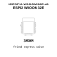
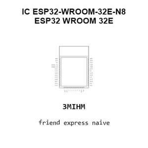
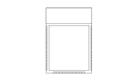
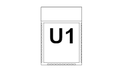
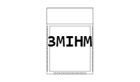
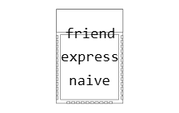
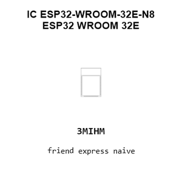
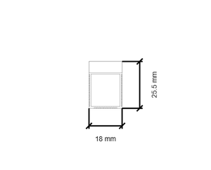
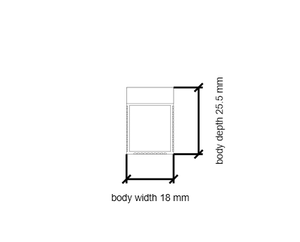

# IC ESP32-WROOM-32E-N8 ESP32 WROOM 32E

`electronic_ic_esp32_wroom_32e_microcontroller_wifi_bluetooth_8_mb_flash_espressif_esp32_wroom_32e_n8`

IC ESP32-WROOM-32E-N8 ESP32 WROOM 32E is an OOMP electronic ic definition. It uses the esp32 wroom 32e package or form factor. Its nominal drawing size is 18.0 &#x00D7; 25.5 mm. The definition includes 39 documented pins.

## At a glance

| Detail | Value |
| --- | --- |
| OOMP ID | `electronic_ic_esp32_wroom_32e_microcontroller_wifi_bluetooth_8_mb_flash_espressif_esp32_wroom_32e_n8` |
| Type | Ic |
| Package / style | esp32 wroom 32e |
| Nominal size | 18.0 &#x00D7; 25.5 mm |
| Documented pins | 39 |

## Classification

| Level | Value |
| --- | --- |
| 1 | `electronic` |
| 2 | `ic` |
| 3 | `esp32_wroom_32e` |
| 4 | `microcontroller` |
| 5 | `wifi_bluetooth_8_mb_flash` |
| 14 | `espressif` |
| 15 | `esp32_wroom_32e_n8` |

## Nominal dimensions

| Measurement | Value |
| --- | ---: |
| Height | 3.1 mm |
| Length | 18.0 mm |
| Width | 25.5 mm |

## Identifiers

| Identifier | Value |
| --- | --- |
| Manufacturer part number | `ESP32-WROOM-32E-N8` |
| LCSC | [`C701342`](https://www.lcsc.com/product-detail/C701342.html) |

## Pins

| Pin | Name | Type |
| ---: | --- | --- |
| 1 | gnd | gnd |
| 2 | 3v3 | power |
| 3 | en | signal |
| 4 | sensor_vp | signal |
| 5 | sensor_vn | signal |
| 6 | io34 | signal |
| 7 | io35 | signal |
| 8 | io32 | signal |
| 9 | io33 | signal |
| 10 | io25 | signal |
| 11 | io26 | signal |
| 12 | io27 | signal |
| 13 | io14 | signal |
| 14 | io12 | signal |
| 15 | gnd | gnd |
| 16 | io13 | signal |
| 17 | nc | no_connect |
| 18 | nc | no_connect |
| 19 | nc | no_connect |
| 20 | nc | no_connect |
| 21 | nc | no_connect |
| 22 | nc | no_connect |
| 23 | io15 | signal |
| 24 | io2 | signal |
| 25 | io0 | signal |
| 26 | io4 | signal |
| 27 | io16 | signal |
| 28 | io17 | signal |
| 29 | io5 | signal |
| 30 | io18 | signal |
| 31 | io19 | signal |
| 32 | nc | no_connect |
| 33 | io21 | signal |
| 34 | rxd0 | signal |
| 35 | txd0 | signal |
| 36 | io22 | signal |
| 37 | io23 | signal |
| 38 | gnd | gnd |
| 39 | gnd_ep | gnd |

## Datasheet

[View the datasheet](data/datasheet.pdf)

## Used in projects

| Project | Quantity | References | Explore |
| --- | ---: | --- | --- |
| [Project hanqaqa/easyduino ESP32 current](https://github.com/Hanqaqa/Easyduino/tree/master/ESP32) | 1 | U2 | [Board explorer](https://oomlout.github.io/oomp_electronic_version_5/parts/oomp_project_github_hanqaqa_easyduino_esp32_current/board_explorer.html) · [OOMP project](https://github.com/oomlout/oomp_electronic_version_5/tree/main/parts/oomp_project_github_hanqaqa_easyduino_esp32_current) |

## Files

[KiCad symbol, machine-solder and hand-solder footprints](data/kicad/README.md) · [Availability and source masters](data/kicad/manifest.yaml)

[View this part on GitHub](https://github.com/oomlout/oomp_electronic_version_5/tree/main/parts/electronic_ic_esp32_wroom_32e_microcontroller_wifi_bluetooth_8_mb_flash_espressif_esp32_wroom_32e_n8)

[Browse this category](../../navigation/electronic/ic/esp32_wroom_32e/microcontroller/wifi_bluetooth_8_mb_flash/espressif/README.md)

---

This page is generated from the OOMP part definition by a Roboclick Jinja template. Edit the source taxonomy or template rather than this generated file.