# IC Microcontroller STM32 St LQFP_48

`electronic_ic_lqfp_48_microcontroller_stm32_st_stm32f103c8tx`

IC Microcontroller STM32 St LQFP_48 is an OOMP electronic ic definition. It uses the lqfp 48 package or form factor. Its nominal drawing size is 9.7 &#x00D7; 9.7 mm. The definition includes 48 documented pins.

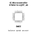

## At a glance

| Detail | Value |
| --- | --- |
| OOMP ID | `electronic_ic_lqfp_48_microcontroller_stm32_st_stm32f103c8tx` |
| Type | Ic |
| Package / style | lqfp 48 |
| Nominal size | 9.7 &#x00D7; 9.7 mm |
| Documented pins | 48 |

## Classification

| Level | Value |
| --- | --- |
| 1 | `electronic` |
| 2 | `ic` |
| 3 | `lqfp_48` |
| 4 | `microcontroller` |
| 5 | `stm32` |
| 14 | `st` |
| 15 | `stm32f103c8tx` |

## Nominal dimensions

| Measurement | Value |
| --- | ---: |
| Height | 1.6 mm |
| Length | 9.7 mm |
| Width | 9.7 mm |

## Pins

| Pin | Name | Type |
| ---: | --- | --- |
| 1 | VBAT | signal |
| 2 | PC13 | signal |
| 3 | PC14 | signal |
| 4 | PC15 | signal |
| 5 | PD0 | signal |
| 6 | PD1 | signal |
| 7 | NRST | signal |
| 8 | VSSA | gnd |
| 9 | VDDA | power |
| 10 | PA0 | signal |
| 11 | PA1 | signal |
| 12 | PA2 | signal |
| 13 | PA3 | signal |
| 14 | PA4 | signal |
| 15 | PA5 | signal |
| 16 | PA6 | signal |
| 17 | PA7 | signal |
| 18 | PB0 | signal |
| 19 | PB1 | signal |
| 20 | PB2 | signal |
| 21 | PB10 | signal |
| 22 | PB11 | signal |
| 23 | VSS | gnd |
| 24 | VDD | power |
| 25 | PB12 | signal |
| 26 | PB13 | signal |
| 27 | PB14 | signal |
| 28 | PB15 | signal |
| 29 | PA8 | signal |
| 30 | PA9 | signal |
| 31 | PA10 | signal |
| 32 | PA11 | signal |
| 33 | PA12 | signal |
| 34 | PA13 | signal |
| 35 | VSS | gnd |
| 36 | VDD | power |
| 37 | PA14 | signal |
| 38 | PA15 | signal |
| 39 | PB3 | signal |
| 40 | PB4 | signal |
| 41 | PB5 | signal |
| 42 | PB6 | signal |
| 43 | PB7 | signal |
| 44 | BOOT0 | signal |
| 45 | PB8 | signal |
| 46 | PB9 | signal |
| 47 | VSS | gnd |
| 48 | VDD | power |

## Files

[KiCad symbol, machine-solder and hand-solder footprints](data/kicad/README.md) · [Availability and source masters](data/kicad/manifest.yaml)

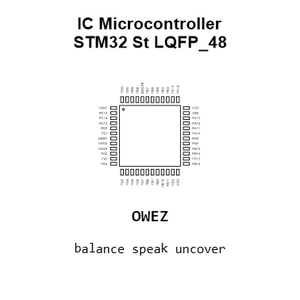

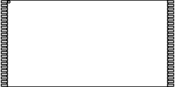

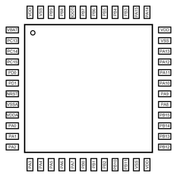

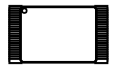

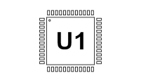

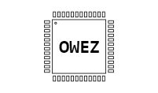

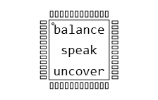

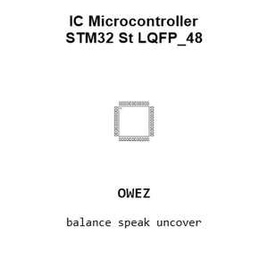

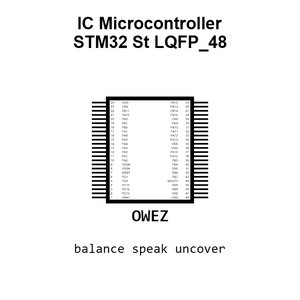

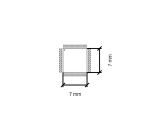

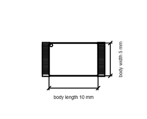

[View this part on GitHub](https://github.com/oomlout/oomp_electronic_version_5/tree/main/parts/electronic_ic_lqfp_48_microcontroller_stm32_st_stm32f103c8tx)

[Browse this category](../../navigation/electronic/ic/lqfp_48/microcontroller/stm32/st/README.md)

---

This page is generated from the OOMP part definition by a Roboclick Jinja template. Edit the source taxonomy or template rather than this generated file.