# IC Microcontroller Wifi Bluetooth Espressif MODULE_ESP_12S

`electronic_ic_module_esp_12s_microcontroller_wifi_bluetooth_espressif_esp_12s`

IC Microcontroller Wifi Bluetooth Espressif MODULE_ESP_12S is an OOMP electronic ic definition. It uses the module esp 12s package or form factor. Its nominal drawing size is 24.0 &#x00D7; 16.0 mm. The definition includes 16 documented pins.

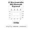

## At a glance

| Detail | Value |
| --- | --- |
| OOMP ID | `electronic_ic_module_esp_12s_microcontroller_wifi_bluetooth_espressif_esp_12s` |
| Type | Ic |
| Package / style | module esp 12s |
| Nominal size | 24.0 &#x00D7; 16.0 mm |
| Documented pins | 16 |

## Classification

| Level | Value |
| --- | --- |
| 1 | `electronic` |
| 2 | `ic` |
| 3 | `module_esp_12s` |
| 4 | `microcontroller` |
| 5 | `wifi_bluetooth` |
| 14 | `espressif` |
| 15 | `esp_12s` |

## Nominal dimensions

| Measurement | Value |
| --- | ---: |
| Height | 3.0 mm |
| Length | 24.0 mm |
| Width | 16.0 mm |

## Pins

| Pin | Name | Type |
| ---: | --- | --- |
| 1 | 1 | signal |
| 2 | 2 | signal |
| 3 | 3 | signal |
| 4 | 4 | signal |
| 5 | 5 | signal |
| 6 | 6 | signal |
| 7 | 7 | signal |
| 8 | 8 | signal |
| 9 | 9 | signal |
| 10 | 10 | signal |
| 11 | 11 | signal |
| 12 | 12 | signal |
| 13 | 13 | signal |
| 14 | 14 | signal |
| 15 | 15 | signal |
| 16 | 16 | signal |

## Used in projects

| Project | Quantity | References | Explore |
| --- | ---: | --- | --- |
| [Project electrolama/oshcamp23-badge OSHCamp 2023 Badge current](https://github.com/electrolama/oshcamp23-badge/tree/main/oomp/version_current/working) | 2 | MOD1, MOD2 | [Board explorer](https://oomlout.github.io/oomp_electronic_version_5/parts/oomp_project_github_electrolama_oshcamp23_badge_oshcamp23_badge_current/board_explorer.html) · [OOMP project](https://github.com/oomlout/oomp_electronic_version_5/tree/main/parts/oomp_project_github_electrolama_oshcamp23_badge_oshcamp23_badge_current) |

## Files

[KiCad symbol, machine-solder and hand-solder footprints](data/kicad/README.md) · [Availability and source masters](data/kicad/manifest.yaml)

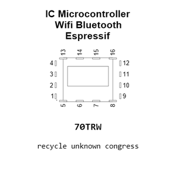

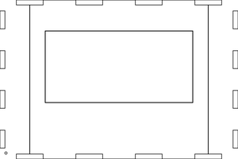

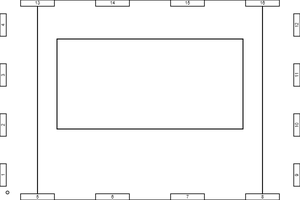

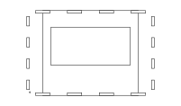

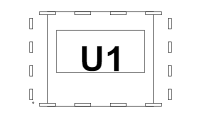

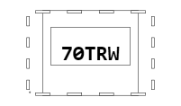

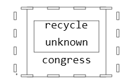

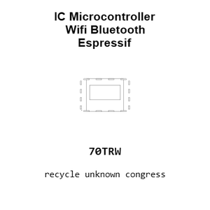

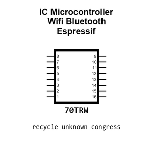

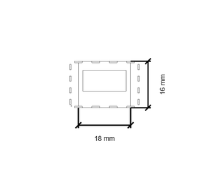

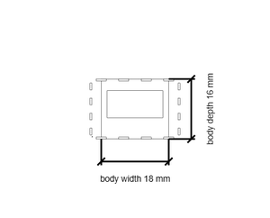

[View this part on GitHub](https://github.com/oomlout/oomp_electronic_version_5/tree/main/parts/electronic_ic_module_esp_12s_microcontroller_wifi_bluetooth_espressif_esp_12s)

[Browse this category](../../navigation/electronic/ic/module_esp_12s/microcontroller/wifi_bluetooth/espressif/README.md)

---

This page is generated from the OOMP part definition by a Roboclick Jinja template. Edit the source taxonomy or template rather than this generated file.