# IC Amplifier Operational Amplifier Sg Micro MSOP_8

`electronic_ic_msop_8_amplifier_operational_amplifier_sg_micro_sgm358yms_tr`

IC Amplifier Operational Amplifier Sg Micro MSOP_8 is an OOMP electronic ic definition. It uses the msop 8 package or form factor. Its nominal drawing size is 10.0 &#x00D7; 5.0 mm.

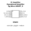

## At a glance

| Detail | Value |
| --- | --- |
| OOMP ID | `electronic_ic_msop_8_amplifier_operational_amplifier_sg_micro_sgm358yms_tr` |
| Type | Ic |
| Package / style | msop 8 |
| Nominal size | 10.0 &#x00D7; 5.0 mm |

## Classification

| Level | Value |
| --- | --- |
| 1 | `electronic` |
| 2 | `ic` |
| 3 | `msop_8` |
| 4 | `amplifier` |
| 5 | `operational_amplifier` |
| 14 | `sg_micro` |
| 15 | `sgm358yms_tr` |

## Nominal dimensions

| Measurement | Value |
| --- | ---: |
| Length | 10.0 mm |
| Width | 5.0 mm |

## Files

[KiCad symbol, machine-solder and hand-solder footprints](data/kicad/README.md) · [Availability and source masters](data/kicad/manifest.yaml)

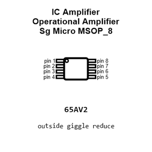

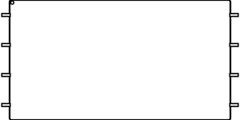

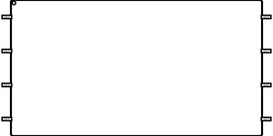

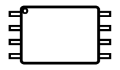

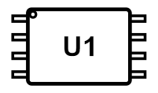

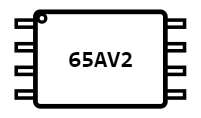

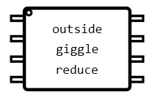

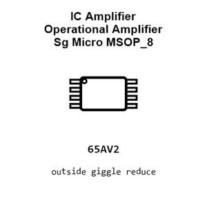

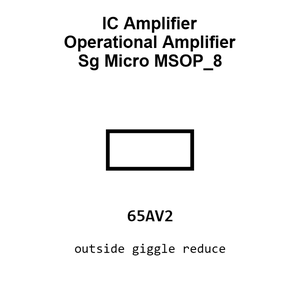

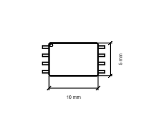

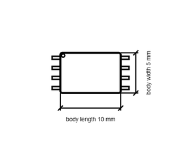

[View this part on GitHub](https://github.com/oomlout/oomp_electronic_version_5/tree/main/parts/electronic_ic_msop_8_amplifier_operational_amplifier_sg_micro_sgm358yms_tr)

[Browse this category](../../navigation/electronic/ic/msop_8/amplifier/operational_amplifier/sg_micro/README.md)

---

This page is generated from the OOMP part definition by a Roboclick Jinja template. Edit the source taxonomy or template rather than this generated file.