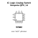
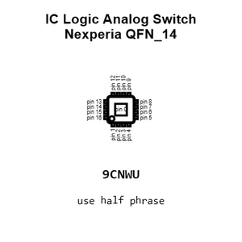
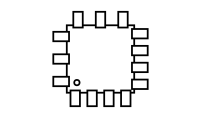
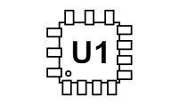
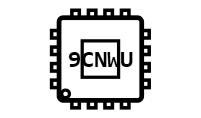
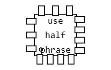
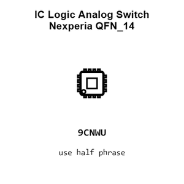
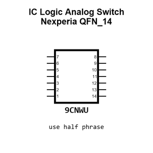
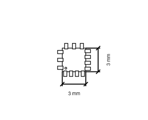
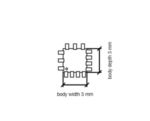

# IC Logic Analog Switch Nexperia QFN_14

`electronic_ic_qfn_14_logic_analog_switch_nexperia_74hc4066bq`

IC Logic Analog Switch Nexperia QFN_14 is an OOMP electronic ic definition. It uses the qfn 14 package or form factor. Its nominal drawing size is 3.0 &#x00D7; 3.0 mm. The definition includes 14 documented pins.

## At a glance

| Detail | Value |
| --- | --- |
| OOMP ID | `electronic_ic_qfn_14_logic_analog_switch_nexperia_74hc4066bq` |
| Type | Ic |
| Package / style | qfn 14 |
| Nominal size | 3.0 &#x00D7; 3.0 mm |
| Documented pins | 14 |

## Classification

| Level | Value |
| --- | --- |
| 1 | `electronic` |
| 2 | `ic` |
| 3 | `qfn_14` |
| 4 | `logic` |
| 5 | `analog_switch` |
| 14 | `nexperia` |
| 15 | `74hc4066bq` |

## Nominal dimensions

| Measurement | Value |
| --- | ---: |
| Height | 0.9 mm |
| Length | 3.0 mm |
| Width | 3.0 mm |

## Pins

| Pin | Name | Type |
| ---: | --- | --- |
| 1 | 1 | signal |
| 2 | 2 | signal |
| 3 | 3 | signal |
| 4 | 4 | signal |
| 5 | 5 | signal |
| 6 | 6 | signal |
| 7 | 7 | signal |
| 8 | 8 | signal |
| 9 | 9 | signal |
| 10 | 10 | signal |
| 11 | 11 | signal |
| 12 | 12 | signal |
| 13 | 13 | signal |
| 14 | 14 | signal |

## Files

[KiCad symbol, machine-solder and hand-solder footprints](data/kicad/README.md) · [Availability and source masters](data/kicad/manifest.yaml)

[View this part on GitHub](https://github.com/oomlout/oomp_electronic_version_5/tree/main/parts/electronic_ic_qfn_14_logic_analog_switch_nexperia_74hc4066bq)

[Browse this category](../../navigation/electronic/ic/qfn_14/logic/analog_switch/nexperia/README.md)

---

This page is generated from the OOMP part definition by a Roboclick Jinja template. Edit the source taxonomy or template rather than this generated file.