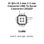
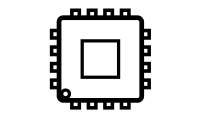
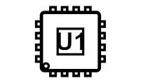
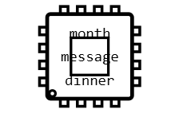
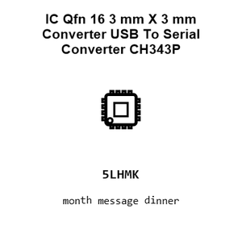
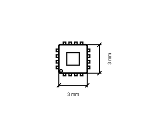

# IC Qfn 16 3 mm X 3 mm Converter USB To Serial Converter CH343P

`electronic_ic_qfn_16_3_mm_x_3_mm_converter_usb_to_serial_converter_wch_ch343p`

IC Qfn 16 3 mm X 3 mm Converter USB To Serial Converter CH343P is an OOMP electronic ic definition. It uses the qfn 16 3 mm x 3 mm package or form factor. Its nominal drawing size is 3.0 &#x00D7; 3.0 mm. The definition includes 17 documented pins.

  
   
  <strong>Pinout</strong> · click for the full-size SVG

## At a glance

| Detail | Value |
| --- | --- |
| OOMP ID | `electronic_ic_qfn_16_3_mm_x_3_mm_converter_usb_to_serial_converter_wch_ch343p` |
| Type | Ic |
| Package / style | qfn 16 3 mm x 3 mm |
| Nominal size | 3.0 &#x00D7; 3.0 mm |
| Documented pins | 17 |

## Diagram gallery

<table>

  <tr>
  
    <td align="center" width="33%">
       
      <strong>Assembly</strong>
    </td>
  
    <td align="center" width="33%">
       
      <strong>Outline</strong>
    </td>
  
    <td align="center" width="33%">
       
      <strong>Part ID</strong>
    </td>
  
  </tr>

  <tr>
  
    <td align="center" width="33%">
       
      <strong>MD5 alpha</strong>
    </td>
  
    <td align="center" width="33%">
       
      <strong>BIP 39 words</strong>
    </td>
  
    <td align="center" width="33%">
       
      <strong>Square summary</strong>
    </td>
  
  </tr>

  <tr>
  
    <td align="center" width="33%">
       
      <strong>Dimensions</strong>
    </td>
  
    <td align="center" width="33%">
       
      <strong>Dimensions with labels</strong>
    </td>
  
  </tr>

</table>

Each preview links to its full-size vector drawing.

## Classification

| Level | Value |
| --- | --- |
| 1 | `electronic` |
| 2 | `ic` |
| 3 | `qfn_16_3_mm_x_3_mm` |
| 4 | `converter` |
| 5 | `usb_to_serial_converter` |
| 14 | `wch` |
| 15 | `ch343p` |

## Nominal dimensions

| Measurement | Value |
| --- | ---: |
| Length | 3.0 mm |
| Width | 3.0 mm |

## Identifiers

| Identifier | Value |
| --- | --- |
| Manufacturer part number | `CH343P` |
| LCSC | `C2846043` |

## Pins

| Pin | Name | Type |
| ---: | --- | --- |
| 0 | gnd | gnd |
| 1 | vio | power |
| 2 | gnd | gnd |
| 3 | vdd5 | power |
| 4 | txd | signal |
| 5 | rxd | signal |
| 6 | v3 | power |
| 7 | ud_positive | signal |
| 8 | ud_negative | signal |
| 9 | vbus | signal |
| 10 | act | signal |
| 11 | dcd | signal |
| 12 | dtr_tnow | signal |
| 13 | rts | signal |
| 14 | dsr | signal |
| 15 | cts | signal |
| 16 | ri | signal |

## Files

- [Pinout drawing](working_svg_square_pins.svg)
- [Assembly drawing](working_svg_assembly.svg)
- [Outline drawing](working_svg_outline.svg)
- [Part ID drawing](working_svg_part_id.svg)
- [MD5 alpha drawing](working_svg_md5_6_alpha.svg)
- [BIP 39 words drawing](working_svg_bip_39_3_word.svg)
- [Square summary](working_svg_square.svg)
- [Dimensioned drawing](working_svg_dimensioned_titles.svg)

- [Datasheet](datasheet.pdf)

- [Structured definition](working.yaml)

[View this part on GitHub](https://github.com/oomlout/oomp_electronic_version_5/tree/main/parts/electronic_ic_qfn_16_3_mm_x_3_mm_converter_usb_to_serial_converter_wch_ch343p)

---

This page is generated from the OOMP part definition by a Roboclick Jinja template. Edit the source taxonomy or template rather than this generated file.