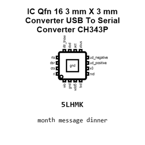
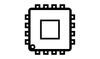
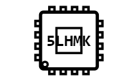
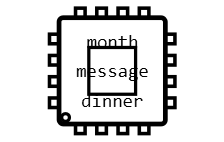
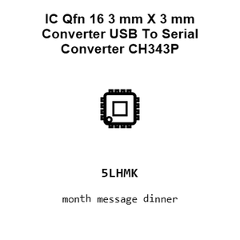
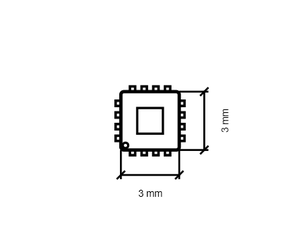
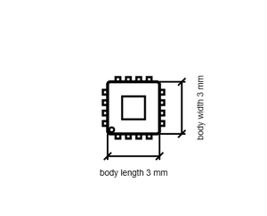

# IC CH343P QFN_16_3_MM_X_3_MM

`electronic_ic_qfn_16_3_mm_x_3_mm_converter_usb_to_serial_converter_wch_ch343p`

IC CH343P QFN_16_3_MM_X_3_MM is an OOMP electronic ic definition. It uses the qfn 16 3 mm x 3 mm package or form factor. Its nominal drawing size is 3.0 &#x00D7; 3.0 mm. The definition includes 17 documented pins.

## At a glance

| Detail | Value |
| --- | --- |
| OOMP ID | `electronic_ic_qfn_16_3_mm_x_3_mm_converter_usb_to_serial_converter_wch_ch343p` |
| Type | Ic |
| Package / style | qfn 16 3 mm x 3 mm |
| Nominal size | 3.0 &#x00D7; 3.0 mm |
| Documented pins | 17 |

## Classification

| Level | Value |
| --- | --- |
| 1 | `electronic` |
| 2 | `ic` |
| 3 | `qfn_16_3_mm_x_3_mm` |
| 4 | `converter` |
| 5 | `usb_to_serial_converter` |
| 14 | `wch` |
| 15 | `ch343p` |

## Nominal dimensions

| Measurement | Value |
| --- | ---: |
| Length | 3.0 mm |
| Width | 3.0 mm |

## Identifiers

| Identifier | Value |
| --- | --- |
| Manufacturer part number | `CH343P` |
| LCSC | [`C2846043`](https://www.lcsc.com/product-detail/C2846043.html) |

## Pins

| Pin | Name | Type |
| ---: | --- | --- |
| 0 | gnd | gnd |
| 1 | vio | power |
| 2 | gnd | gnd |
| 3 | vdd5 | power |
| 4 | txd | signal |
| 5 | rxd | signal |
| 6 | v3 | power |
| 7 | ud_positive | signal |
| 8 | ud_negative | signal |
| 9 | vbus | signal |
| 10 | act | signal |
| 11 | dcd | signal |
| 12 | dtr_tnow | signal |
| 13 | rts | signal |
| 14 | dsr | signal |
| 15 | cts | signal |
| 16 | ri | signal |

## Datasheet

[View the datasheet](data/datasheet.pdf)

## Files

[View this part on GitHub](https://github.com/oomlout/oomp_electronic_version_5/tree/main/parts/electronic_ic_qfn_16_3_mm_x_3_mm_converter_usb_to_serial_converter_wch_ch343p)

[Browse this category](../../navigation/electronic/ic/qfn_16_3_mm_x_3_mm/converter/usb_to_serial_converter/wch/README.md)

---

This page is generated from the OOMP part definition by a Roboclick Jinja template. Edit the source taxonomy or template rather than this generated file.