# IC Converter Usb To Serial Converter Wch QFN_24

`electronic_ic_qfn_24_converter_usb_to_serial_converter_wch_ch342f`

IC Converter Usb To Serial Converter Wch QFN_24 is an OOMP electronic ic definition. It uses the qfn 24 package or form factor. Its nominal drawing size is 10.0 &#x00D7; 5.0 mm.

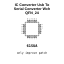

## At a glance

| Detail | Value |
| --- | --- |
| OOMP ID | `electronic_ic_qfn_24_converter_usb_to_serial_converter_wch_ch342f` |
| Type | Ic |
| Package / style | qfn 24 |
| Nominal size | 10.0 &#x00D7; 5.0 mm |

## Classification

| Level | Value |
| --- | --- |
| 1 | `electronic` |
| 2 | `ic` |
| 3 | `qfn_24` |
| 4 | `converter` |
| 5 | `usb_to_serial_converter` |
| 14 | `wch` |
| 15 | `ch342f` |

## Nominal dimensions

| Measurement | Value |
| --- | ---: |
| Length | 10.0 mm |
| Width | 5.0 mm |

## Files

[KiCad symbol, machine-solder and hand-solder footprints](data/kicad/README.md) · [Availability and source masters](data/kicad/manifest.yaml)

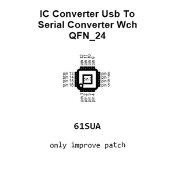

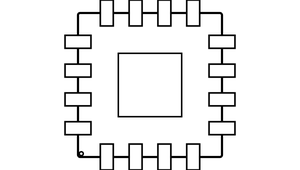

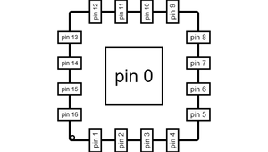

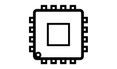

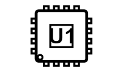

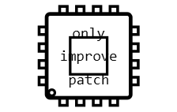

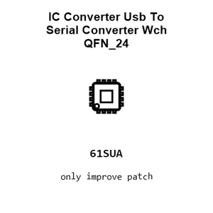

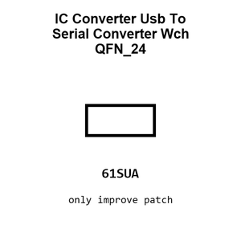

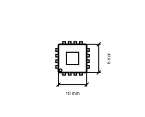

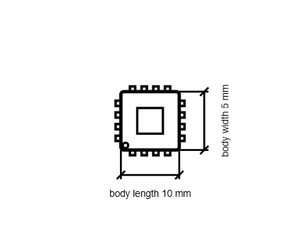

[View this part on GitHub](https://github.com/oomlout/oomp_electronic_version_5/tree/main/parts/electronic_ic_qfn_24_converter_usb_to_serial_converter_wch_ch342f)

[Browse this category](../../navigation/electronic/ic/qfn_24/converter/usb_to_serial_converter/wch/README.md)

---

This page is generated from the OOMP part definition by a Roboclick Jinja template. Edit the source taxonomy or template rather than this generated file.