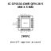
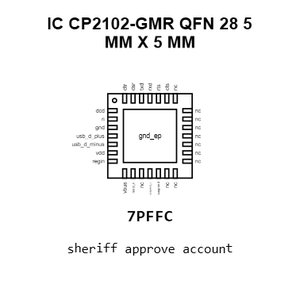
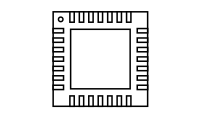
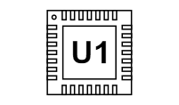
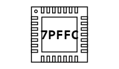
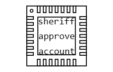
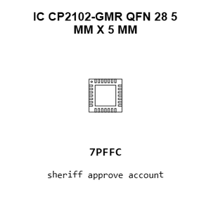
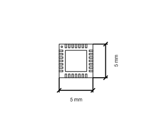
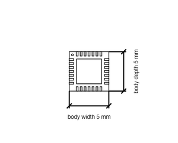

# IC CP2102-GMR QFN 28 5 MM X 5 MM

`electronic_ic_qfn_28_5_mm_x_5_mm_converter_usb_to_serial_converter_silicon_labs_cp2102_gmr`

IC CP2102-GMR QFN 28 5 MM X 5 MM is an OOMP electronic ic definition. It uses the qfn 28 5 mm x 5 mm package or form factor. Its nominal drawing size is 5.0 &#x00D7; 5.0 mm. The definition includes 29 documented pins.

## At a glance

| Detail | Value |
| --- | --- |
| OOMP ID | `electronic_ic_qfn_28_5_mm_x_5_mm_converter_usb_to_serial_converter_silicon_labs_cp2102_gmr` |
| Type | Ic |
| Package / style | qfn 28 5 mm x 5 mm |
| Nominal size | 5.0 &#x00D7; 5.0 mm |
| Documented pins | 29 |

## Classification

| Level | Value |
| --- | --- |
| 1 | `electronic` |
| 2 | `ic` |
| 3 | `qfn_28_5_mm_x_5_mm` |
| 4 | `converter` |
| 5 | `usb_to_serial_converter` |
| 14 | `silicon_labs` |
| 15 | `cp2102_gmr` |

## Nominal dimensions

| Measurement | Value |
| --- | ---: |
| Length | 5.0 mm |
| Width | 5.0 mm |

## Identifiers

| Identifier | Value |
| --- | --- |
| Manufacturer part number | `CP2102-GMR` |
| LCSC | [`C6568`](https://www.lcsc.com/product-detail/C6568.html) |

## Pins

| Pin | Name | Type |
| ---: | --- | --- |
| 1 | dcd | signal |
| 2 | ri | signal |
| 3 | gnd | signal |
| 4 | usb_d_plus | signal |
| 5 | usb_d_minus | signal |
| 6 | vdd | signal |
| 7 | regin | signal |
| 8 | vbus | signal |
| 9 | reset_n | signal |
| 10 | nc | no_connect |
| 11 | suspend_n | signal |
| 12 | suspend | signal |
| 13 | nc | no_connect |
| 14 | nc | no_connect |
| 15 | nc | no_connect |
| 16 | nc | no_connect |
| 17 | nc | no_connect |
| 18 | nc | no_connect |
| 19 | nc | no_connect |
| 20 | nc | no_connect |
| 21 | nc | no_connect |
| 22 | nc | no_connect |
| 23 | cts | signal |
| 24 | rts | signal |
| 25 | rxd | signal |
| 26 | txd | signal |
| 27 | dsr | signal |
| 28 | dtr | signal |
| 29 | gnd_ep | signal |

## Datasheet

[View the datasheet](data/datasheet.pdf)

## Files

[KiCad symbol, machine-solder and hand-solder footprints](data/kicad/README.md) · [Availability and source masters](data/kicad/manifest.yaml)

[View this part on GitHub](https://github.com/oomlout/oomp_electronic_version_5/tree/main/parts/electronic_ic_qfn_28_5_mm_x_5_mm_converter_usb_to_serial_converter_silicon_labs_cp2102_gmr)

[Browse this category](../../navigation/electronic/ic/qfn_28_5_mm_x_5_mm/converter/usb_to_serial_converter/silicon_labs/README.md)

---

This page is generated from the OOMP part definition by a Roboclick Jinja template. Edit the source taxonomy or template rather than this generated file.