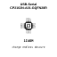
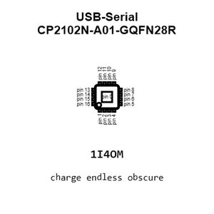
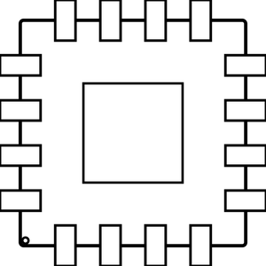
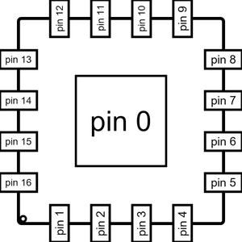
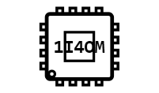
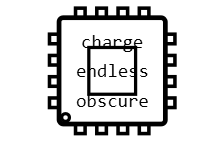
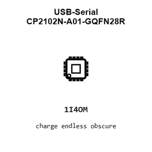
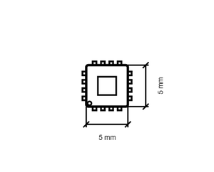
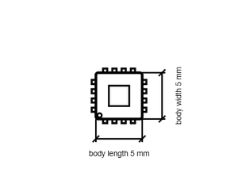

# USB-Serial CP2102N-A01-GQFN28R

`electronic_ic_qfn_28_5_mm_x_5_mm_converter_usb_to_serial_converter_silicon_labs_cp2102n_a01_gqfn28r`

USB-Serial CP2102N-A01-GQFN28R is an OOMP electronic ic definition. It uses the qfn 28 5 mm x 5 mm package or form factor. Its nominal drawing size is 5.0 &#x00D7; 5.0 mm.

## At a glance

| Detail | Value |
| --- | --- |
| OOMP ID | `electronic_ic_qfn_28_5_mm_x_5_mm_converter_usb_to_serial_converter_silicon_labs_cp2102n_a01_gqfn28r` |
| Type | Ic |
| Package / style | qfn 28 5 mm x 5 mm |
| Nominal size | 5.0 &#x00D7; 5.0 mm |

## Classification

| Level | Value |
| --- | --- |
| 1 | `electronic` |
| 2 | `ic` |
| 3 | `qfn_28_5_mm_x_5_mm` |
| 4 | `converter` |
| 5 | `usb_to_serial_converter` |
| 14 | `silicon_labs` |
| 15 | `cp2102n_a01_gqfn28r` |

## Nominal dimensions

| Measurement | Value |
| --- | ---: |
| Length | 5.0 mm |
| Width | 5.0 mm |

## Identifiers

| Identifier | Value |
| --- | --- |
| Manufacturer part number | `CP2102N-A01-GQFN28R` |
| LCSC | [`C105167`](https://www.lcsc.com/product-detail/C105167.html) |

## Files

[KiCad symbol, machine-solder and hand-solder footprints](data/kicad/README.md) · [Availability and source masters](data/kicad/manifest.yaml)

[View this part on GitHub](https://github.com/oomlout/oomp_electronic_version_5/tree/main/parts/electronic_ic_qfn_28_5_mm_x_5_mm_converter_usb_to_serial_converter_silicon_labs_cp2102n_a01_gqfn28r)

[Browse this category](../../navigation/electronic/ic/qfn_28_5_mm_x_5_mm/converter/usb_to_serial_converter/silicon_labs/README.md)

---

This page is generated from the OOMP part definition by a Roboclick Jinja template. Edit the source taxonomy or template rather than this generated file.