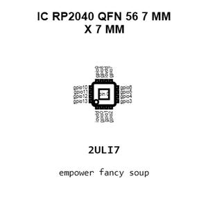
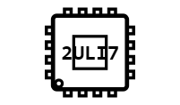
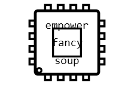
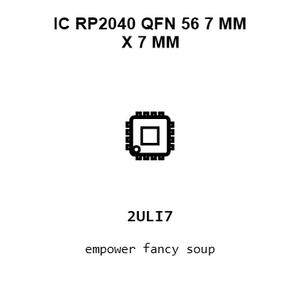
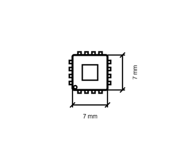
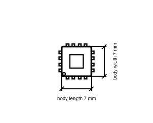

# IC RP2040 QFN 56 7 MM X 7 MM

`electronic_ic_qfn_56_7_mm_x_7_mm_microcontroller_dual_core_arm_cortex_m0_plus_raspberry_pi_rp2040`

IC RP2040 QFN 56 7 MM X 7 MM is an OOMP electronic ic definition. It uses the qfn 56 7 mm x 7 mm package or form factor. Its nominal drawing size is 7.0 &#x00D7; 7.0 mm. The definition includes 57 documented pins.

## At a glance

| Detail | Value |
| --- | --- |
| OOMP ID | `electronic_ic_qfn_56_7_mm_x_7_mm_microcontroller_dual_core_arm_cortex_m0_plus_raspberry_pi_rp2040` |
| Type | Ic |
| Package / style | qfn 56 7 mm x 7 mm |
| Nominal size | 7.0 &#x00D7; 7.0 mm |
| Documented pins | 57 |

## Classification

| Level | Value |
| --- | --- |
| 1 | `electronic` |
| 2 | `ic` |
| 3 | `qfn_56_7_mm_x_7_mm` |
| 4 | `microcontroller` |
| 5 | `dual_core_arm_cortex_m0_plus` |
| 14 | `raspberry_pi` |
| 15 | `rp2040` |

## Nominal dimensions

| Measurement | Value |
| --- | ---: |
| Length | 7.0 mm |
| Width | 7.0 mm |

## Identifiers

| Identifier | Value |
| --- | --- |
| Manufacturer part number | `RP2040` |
| LCSC | [`C2040`](https://www.lcsc.com/product-detail/C2040.html) |

## Pins

| Pin | Name | Type |
| ---: | --- | --- |
| 1 | iovdd | signal |
| 2 | gpio0 | signal |
| 3 | gpio1 | signal |
| 4 | gpio2 | signal |
| 5 | gpio3 | signal |
| 6 | gpio4 | signal |
| 7 | gpio5 | signal |
| 8 | gpio6 | signal |
| 9 | gpio7 | signal |
| 10 | iovdd | signal |
| 11 | gpio8 | signal |
| 12 | gpio9 | signal |
| 13 | gpio10 | signal |
| 14 | gpio11 | signal |
| 15 | gpio12 | signal |
| 16 | gpio13 | signal |
| 17 | gpio14 | signal |
| 18 | gpio15 | signal |
| 19 | testen | signal |
| 20 | xin | signal |
| 21 | xout | signal |
| 22 | iovdd | signal |
| 23 | dvdd | signal |
| 24 | swclk | signal |
| 25 | swd | signal |
| 26 | run | signal |
| 27 | gpio16 | signal |
| 28 | gpio17 | signal |
| 29 | gpio18 | signal |
| 30 | gpio19 | signal |
| 31 | gpio20 | signal |
| 32 | gpio21 | signal |
| 33 | iovdd | signal |
| 34 | gpio22 | signal |
| 35 | gpio23 | signal |
| 36 | gpio24 | signal |
| 37 | gpio25 | signal |
| 38 | gpio26_adc0 | signal |
| 39 | gpio27_adc1 | signal |
| 40 | gpio28_adc2 | signal |
| 41 | gpio29_adc3 | signal |
| 42 | iovdd | signal |
| 43 | adc_avdd | signal |
| 44 | vreg_in | signal |
| 45 | vreg_vout | signal |
| 46 | usb_dm | signal |
| 47 | usb_dp | signal |
| 48 | usb_vdd | signal |
| 49 | iovdd | signal |
| 50 | dvdd | signal |
| 51 | qspi_sd3 | signal |
| 52 | qspi_sclk | signal |
| 53 | qspi_sd0 | signal |
| 54 | qspi_sd2 | signal |
| 55 | qspi_sd1 | signal |
| 56 | qspi_ss | signal |
| 57 | gnd | signal |

## Datasheet

[View the datasheet](data/datasheet.pdf)

## Used in projects

| Project | Quantity | References | Explore |
| --- | ---: | --- | --- |
| [Project dangerousprototypes/buspirate5_hardware 5_rev10a](https://github.com/DangerousPrototypes/BusPirate5-hardware) | 1 | U103 | [Board explorer](https://oomlout.github.io/oomp_electronic_version_5/parts/oomp_project_github_dangerousprototypes_buspirate5_hardware_5_rev10a/board_explorer.html) · [OOMP project](https://github.com/oomlout/oomp_electronic_version_5/tree/main/parts/oomp_project_github_dangerousprototypes_buspirate5_hardware_5_rev10a) |

## Files

[KiCad symbol, machine-solder and hand-solder footprints](data/kicad/README.md) · [Availability and source masters](data/kicad/manifest.yaml)

[View this part on GitHub](https://github.com/oomlout/oomp_electronic_version_5/tree/main/parts/electronic_ic_qfn_56_7_mm_x_7_mm_microcontroller_dual_core_arm_cortex_m0_plus_raspberry_pi_rp2040)

[Browse this category](../../navigation/electronic/ic/qfn_56_7_mm_x_7_mm/microcontroller/dual_core_arm_cortex_m0_plus/raspberry_pi/README.md)

---

This page is generated from the OOMP part definition by a Roboclick Jinja template. Edit the source taxonomy or template rather than this generated file.