# IC LTV-817S-TA1-C SMD 4P

`electronic_ic_smd_4p_optocoupler_phototransistor_output_lite_on_ltv_817s_ta1_c`

IC LTV-817S-TA1-C SMD 4P is an OOMP electronic ic definition. It uses the smd 4p package or form factor. Its nominal drawing size is 10.0 &#x00D7; 5.0 mm.

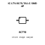

## At a glance

| Detail | Value |
| --- | --- |
| OOMP ID | `electronic_ic_smd_4p_optocoupler_phototransistor_output_lite_on_ltv_817s_ta1_c` |
| Type | Ic |
| Package / style | smd 4p |
| Nominal size | 10.0 &#x00D7; 5.0 mm |

## Classification

| Level | Value |
| --- | --- |
| 1 | `electronic` |
| 2 | `ic` |
| 3 | `smd_4p` |
| 4 | `optocoupler` |
| 5 | `phototransistor_output` |
| 14 | `lite_on` |
| 15 | `ltv_817s_ta1_c` |

## Nominal dimensions

| Measurement | Value |
| --- | ---: |
| Length | 10.0 mm |
| Width | 5.0 mm |

## Identifiers

| Identifier | Value |
| --- | --- |
| Manufacturer part number | `LTV-817S-TA1-C` |
| LCSC | [`C109227`](https://www.lcsc.com/product-detail/C109227.html) |
| JLCPCB | [`C109227`](https://jlcpcb.com/partdetail/LiteOn-LTV_817S_TA1C/C109227) |

## Files

[KiCad symbol, machine-solder and hand-solder footprints](data/kicad/README.md) · [Availability and source masters](data/kicad/manifest.yaml)

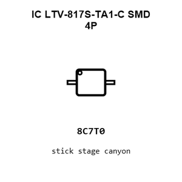

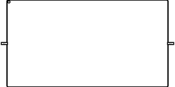

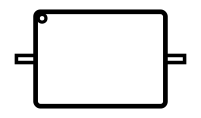

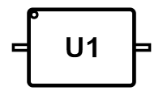

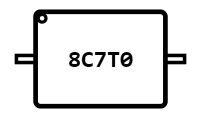

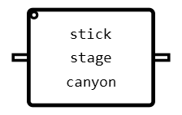

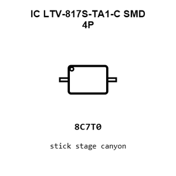

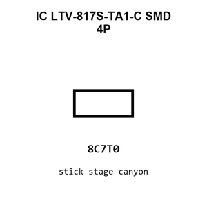

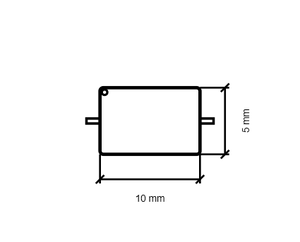

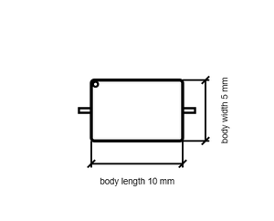

[View this part on GitHub](https://github.com/oomlout/oomp_electronic_version_5/tree/main/parts/electronic_ic_smd_4p_optocoupler_phototransistor_output_lite_on_ltv_817s_ta1_c)

[Browse this category](../../navigation/electronic/ic/smd_4p/optocoupler/phototransistor_output/lite_on/README.md)

---

This page is generated from the OOMP part definition by a Roboclick Jinja template. Edit the source taxonomy or template rather than this generated file.