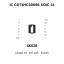
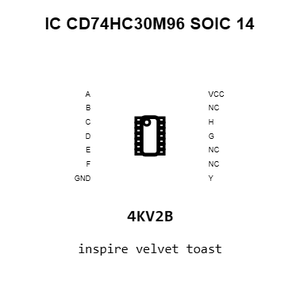
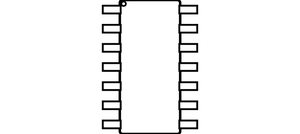
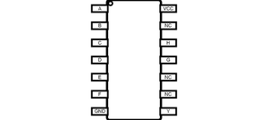
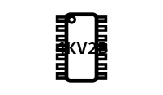
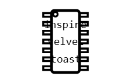
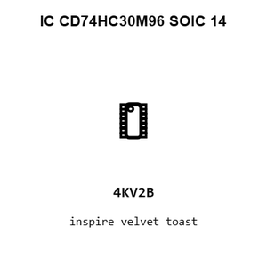
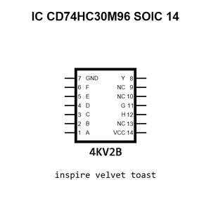

# IC CD74HC30M96 SOIC 14

`electronic_ic_soic_14_logic_8_input_nand_gate_texas_instruments_cd74hc30m96`

IC CD74HC30M96 SOIC 14 is an OOMP electronic ic definition. It uses the soic 14 package or form factor. Its nominal drawing size is 8.7 &#x00D7; 3.9 mm. The definition includes 14 documented pins.

## At a glance

| Detail | Value |
| --- | --- |
| OOMP ID | `electronic_ic_soic_14_logic_8_input_nand_gate_texas_instruments_cd74hc30m96` |
| Type | Ic |
| Package / style | soic 14 |
| Nominal size | 8.7 &#x00D7; 3.9 mm |
| Documented pins | 14 |

## Classification

| Level | Value |
| --- | --- |
| 1 | `electronic` |
| 2 | `ic` |
| 3 | `soic_14` |
| 4 | `logic` |
| 5 | `8_input_nand_gate` |
| 14 | `texas_instruments` |
| 15 | `cd74hc30m96` |

## Nominal dimensions

| Measurement | Value |
| --- | ---: |
| Height | 1.75 mm |
| Length | 8.7 mm |
| Width | 3.9 mm |

## Identifiers

| Identifier | Value |
| --- | --- |
| Manufacturer part number | `CD74HC30M96` |
| LCSC | [`C6540`](https://www.lcsc.com/product-detail/C6540.html) |
| JLCPCB | [`C6540`](https://jlcpcb.com/partdetail/TexasInstruments-CD74HC30M96/C6540) |

## Pins

| Pin | Name | Type |
| ---: | --- | --- |
| 1 | A | in |
| 2 | B | in |
| 3 | C | in |
| 4 | D | in |
| 5 | E | in |
| 6 | F | in |
| 7 | GND | pwr |
| 8 | Y | out |
| 9 | NC | no_connect |
| 10 | NC | no_connect |
| 11 | G | in |
| 12 | H | in |
| 13 | NC | no_connect |
| 14 | VCC | pwr |

## Datasheet

[View the datasheet](data/datasheet.pdf)

## Files

[KiCad symbol, machine-solder and hand-solder footprints](data/kicad/README.md) · [Availability and source masters](data/kicad/manifest.yaml)

[View this part on GitHub](https://github.com/oomlout/oomp_electronic_version_5/tree/main/parts/electronic_ic_soic_14_logic_8_input_nand_gate_texas_instruments_cd74hc30m96)

[Browse this category](../../navigation/electronic/ic/soic_14/logic/8_input_nand_gate/texas_instruments/README.md)

---

This page is generated from the OOMP part definition by a Roboclick Jinja template. Edit the source taxonomy or template rather than this generated file.