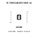
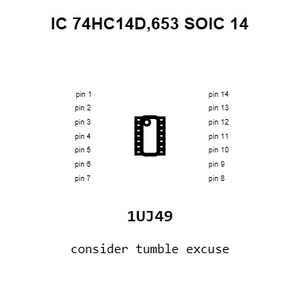
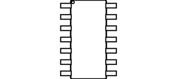
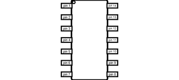
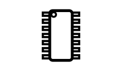
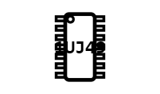
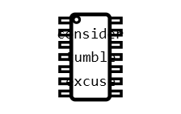
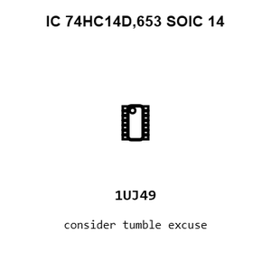
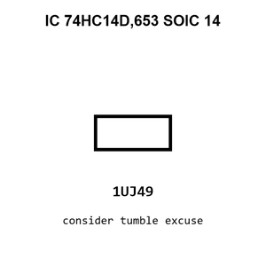
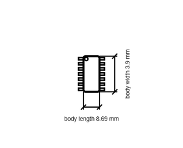

# IC 74HC14D,653 SOIC 14

`electronic_ic_soic_14_logic_hex_schmitt_trigger_inverter_nexperia_74hc14d_653`

IC 74HC14D,653 SOIC 14 is an OOMP electronic ic definition. It uses the soic 14 package or form factor. Its nominal drawing size is 8.69 &#x00D7; 3.9 mm.

## At a glance

| Detail | Value |
| --- | --- |
| OOMP ID | `electronic_ic_soic_14_logic_hex_schmitt_trigger_inverter_nexperia_74hc14d_653` |
| Type | Ic |
| Package / style | soic 14 |
| Nominal size | 8.69 &#x00D7; 3.9 mm |

## Classification

| Level | Value |
| --- | --- |
| 1 | `electronic` |
| 2 | `ic` |
| 3 | `soic_14` |
| 4 | `logic` |
| 5 | `hex_schmitt_trigger_inverter` |
| 14 | `nexperia` |
| 15 | `74hc14d_653` |

## Nominal dimensions

| Measurement | Value |
| --- | ---: |
| Length | 8.69 mm |
| Width | 3.9 mm |

## Identifiers

| Identifier | Value |
| --- | --- |
| Manufacturer part number | `74HC14D,653` |
| LCSC | [`C5605`](https://www.lcsc.com/product-detail/C5605.html) |
| JLCPCB | [`C5605`](https://jlcpcb.com/partdetail/Nexperia-74HC14D653/C5605) |

## Files

[KiCad symbol, machine-solder and hand-solder footprints](data/kicad/README.md) · [Availability and source masters](data/kicad/manifest.yaml)

[View this part on GitHub](https://github.com/oomlout/oomp_electronic_version_5/tree/main/parts/electronic_ic_soic_14_logic_hex_schmitt_trigger_inverter_nexperia_74hc14d_653)

[Browse this category](../../navigation/electronic/ic/soic_14/logic/hex_schmitt_trigger_inverter/nexperia/README.md)

---

This page is generated from the OOMP part definition by a Roboclick Jinja template. Edit the source taxonomy or template rather than this generated file.