# IC Microcontroller 8 Bit Avr Microchip SOIC_14

`electronic_ic_soic_14_microcontroller_8_bit_avr_microchip_attiny1604_ssnr`

IC Microcontroller 8 Bit Avr Microchip SOIC_14 is an OOMP electronic ic definition. It uses the soic 14 package or form factor. Its nominal drawing size is 8.69 &#x00D7; 3.9 mm. The definition includes 14 documented pins.

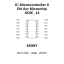

## At a glance

| Detail | Value |
| --- | --- |
| OOMP ID | `electronic_ic_soic_14_microcontroller_8_bit_avr_microchip_attiny1604_ssnr` |
| Type | Ic |
| Package / style | soic 14 |
| Nominal size | 8.69 &#x00D7; 3.9 mm |
| Documented pins | 14 |

## Classification

| Level | Value |
| --- | --- |
| 1 | `electronic` |
| 2 | `ic` |
| 3 | `soic_14` |
| 4 | `microcontroller` |
| 5 | `8_bit_avr` |
| 14 | `microchip` |
| 15 | `attiny1604_ssnr` |

## Nominal dimensions

| Measurement | Value |
| --- | ---: |
| Height | 1.75 mm |
| Length | 8.69 mm |
| Width | 3.9 mm |

## Pins

| Pin | Name | Type |
| ---: | --- | --- |
| 1 | VDD | power |
| 2 | PA4 | signal |
| 3 | PA5 | signal |
| 4 | PA6 | signal |
| 5 | PA7 | signal |
| 6 | PB5 | signal |
| 7 | PB4 | signal |
| 8 | PB3 | signal |
| 9 | PB2 | signal |
| 10 | PB1 | signal |
| 11 | PB0 | signal |
| 12 | PA3 | signal |
| 13 | PA2 | signal |
| 14 | GND | gnd |

## Used in projects

| Project | Quantity | References | Explore |
| --- | ---: | --- | --- |
| [Project soldered_electronics/GNSS-GPS-L86-M33-breakout-with-easyC-hardware-design L86-M33 GNSS easyC current](https://github.com/SolderedElectronics/GNSS-GPS-L86-M33-breakout-with-easyC-hardware-design) | 1 | U5 | [Board explorer](https://oomlout.github.io/oomp_electronic_version_5/parts/oomp_project_github_soldered_electronics_gnss_gps_l86_m33_breakout_with_easy_c_hardware_design_sensor_gnss_l86m33_easyc_current/board_explorer.html) · [OOMP project](https://github.com/oomlout/oomp_electronic_version_5/tree/main/parts/oomp_project_github_soldered_electronics_gnss_gps_l86_m33_breakout_with_easy_c_hardware_design_sensor_gnss_l86m33_easyc_current) |

## Files

[KiCad symbol, machine-solder and hand-solder footprints](data/kicad/README.md) · [Availability and source masters](data/kicad/manifest.yaml)

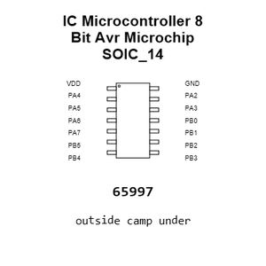

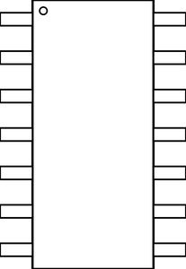

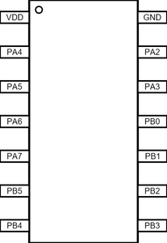

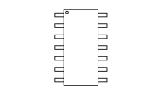

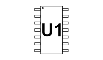

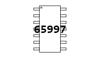

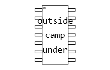

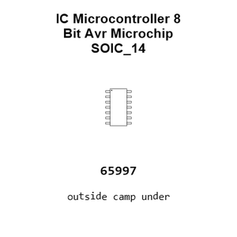

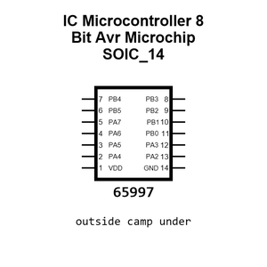

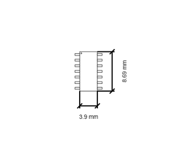

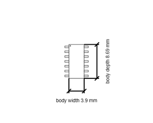

[View this part on GitHub](https://github.com/oomlout/oomp_electronic_version_5/tree/main/parts/electronic_ic_soic_14_microcontroller_8_bit_avr_microchip_attiny1604_ssnr)

[Browse this category](../../navigation/electronic/ic/soic_14/microcontroller/8_bit_avr/microchip/README.md)

---

This page is generated from the OOMP part definition by a Roboclick Jinja template. Edit the source taxonomy or template rather than this generated file.