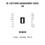
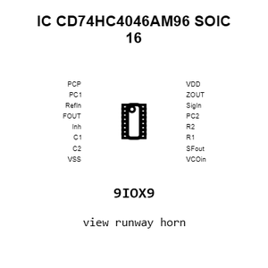
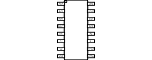
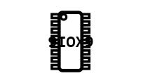
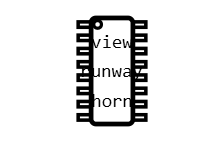
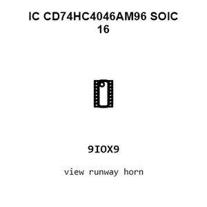
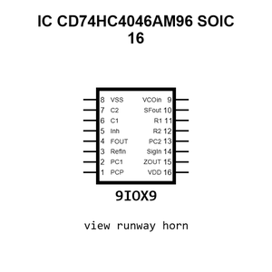
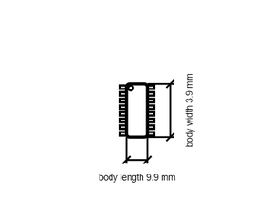

# IC CD74HC4046AM96 SOIC 16

`electronic_ic_soic_16_clock_management_pll_with_vco_texas_instruments_cd74hc4046am96`

IC CD74HC4046AM96 SOIC 16 is an OOMP electronic ic definition. It uses the soic 16 package or form factor. Its nominal drawing size is 9.9 &#x00D7; 3.9 mm. The definition includes 16 documented pins.

## At a glance

| Detail | Value |
| --- | --- |
| OOMP ID | `electronic_ic_soic_16_clock_management_pll_with_vco_texas_instruments_cd74hc4046am96` |
| Type | Ic |
| Package / style | soic 16 |
| Nominal size | 9.9 &#x00D7; 3.9 mm |
| Documented pins | 16 |

## Classification

| Level | Value |
| --- | --- |
| 1 | `electronic` |
| 2 | `ic` |
| 3 | `soic_16` |
| 4 | `clock_management` |
| 5 | `pll_with_vco` |
| 14 | `texas_instruments` |
| 15 | `cd74hc4046am96` |

## Nominal dimensions

| Measurement | Value |
| --- | ---: |
| Height | 1.75 mm |
| Length | 9.9 mm |
| Width | 3.9 mm |

## Identifiers

| Identifier | Value |
| --- | --- |
| Manufacturer part number | `CD74HC4046AM96` |
| LCSC | [`C6542`](https://www.lcsc.com/product-detail/C6542.html) |
| JLCPCB | [`C6542`](https://jlcpcb.com/partdetail/TexasInstruments-CD74HC4046AM96/C6542) |

## Pins

| Pin | Name | Type |
| ---: | --- | --- |
| 1 | PCP | out |
| 2 | PC1 | out |
| 3 | RefIn | in |
| 4 | FOUT | out |
| 5 | Inh | in |
| 6 | C1 | in |
| 7 | C2 | in |
| 8 | VSS | pwr |
| 9 | VCOin | in |
| 10 | SFout | out |
| 11 | R1 | in |
| 12 | R2 | in |
| 13 | PC2 | ts |
| 14 | SigIn | in |
| 15 | ZOUT | out |
| 16 | VDD | pwr |

## Datasheet

[View the datasheet](data/datasheet.pdf)

## Files

[KiCad symbol, machine-solder and hand-solder footprints](data/kicad/README.md) · [Availability and source masters](data/kicad/manifest.yaml)

[View this part on GitHub](https://github.com/oomlout/oomp_electronic_version_5/tree/main/parts/electronic_ic_soic_16_clock_management_pll_with_vco_texas_instruments_cd74hc4046am96)

[Browse this category](../../navigation/electronic/ic/soic_16/clock_management/pll_with_vco/texas_instruments/README.md)

---

This page is generated from the OOMP part definition by a Roboclick Jinja template. Edit the source taxonomy or template rather than this generated file.