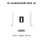
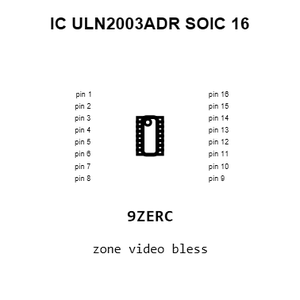
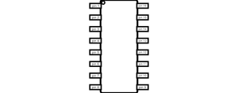
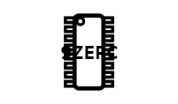
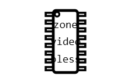
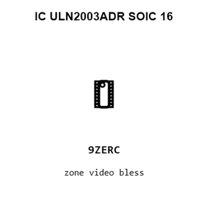
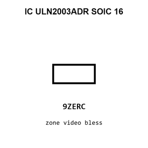

# IC ULN2003ADR SOIC 16

`electronic_ic_soic_16_driver_darlington_array_texas_instruments_uln2003adr`

IC ULN2003ADR SOIC 16 is an OOMP electronic ic definition. It uses the soic 16 package or form factor. Its nominal drawing size is 9.9 &#x00D7; 3.9 mm.

## At a glance

| Detail | Value |
| --- | --- |
| OOMP ID | `electronic_ic_soic_16_driver_darlington_array_texas_instruments_uln2003adr` |
| Type | Ic |
| Package / style | soic 16 |
| Nominal size | 9.9 &#x00D7; 3.9 mm |

## Classification

| Level | Value |
| --- | --- |
| 1 | `electronic` |
| 2 | `ic` |
| 3 | `soic_16` |
| 4 | `driver` |
| 5 | `darlington_array` |
| 14 | `texas_instruments` |
| 15 | `uln2003adr` |

## Nominal dimensions

| Measurement | Value |
| --- | ---: |
| Length | 9.9 mm |
| Width | 3.9 mm |

## Identifiers

| Identifier | Value |
| --- | --- |
| Manufacturer part number | `ULN2003ADR` |
| LCSC | [`C7512`](https://www.lcsc.com/product-detail/C7512.html) |
| JLCPCB | [`C7512`](https://jlcpcb.com/partdetail/TexasInstruments-ULN2003ADR/C7512) |

## Files

[KiCad symbol, machine-solder and hand-solder footprints](data/kicad/README.md) · [Availability and source masters](data/kicad/manifest.yaml)

[View this part on GitHub](https://github.com/oomlout/oomp_electronic_version_5/tree/main/parts/electronic_ic_soic_16_driver_darlington_array_texas_instruments_uln2003adr)

[Browse this category](../../navigation/electronic/ic/soic_16/driver/darlington_array/texas_instruments/README.md)

---

This page is generated from the OOMP part definition by a Roboclick Jinja template. Edit the source taxonomy or template rather than this generated file.