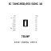
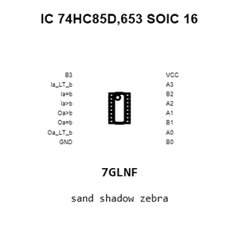
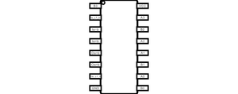
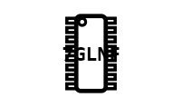
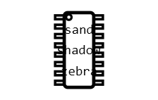
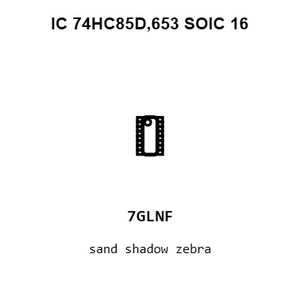
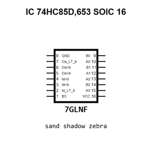

# IC 74HC85D,653 SOIC 16

`electronic_ic_soic_16_logic_4_bit_magnitude_comparator_nexperia_74hc85d_653`

IC 74HC85D,653 SOIC 16 is an OOMP electronic ic definition. It uses the soic 16 package or form factor. Its nominal drawing size is 9.9 &#x00D7; 3.9 mm. The definition includes 16 documented pins.

## At a glance

| Detail | Value |
| --- | --- |
| OOMP ID | `electronic_ic_soic_16_logic_4_bit_magnitude_comparator_nexperia_74hc85d_653` |
| Type | Ic |
| Package / style | soic 16 |
| Nominal size | 9.9 &#x00D7; 3.9 mm |
| Documented pins | 16 |

## Classification

| Level | Value |
| --- | --- |
| 1 | `electronic` |
| 2 | `ic` |
| 3 | `soic_16` |
| 4 | `logic` |
| 5 | `4_bit_magnitude_comparator` |
| 14 | `nexperia` |
| 15 | `74hc85d_653` |

## Nominal dimensions

| Measurement | Value |
| --- | ---: |
| Height | 1.75 mm |
| Length | 9.9 mm |
| Width | 3.9 mm |

## Identifiers

| Identifier | Value |
| --- | --- |
| Manufacturer part number | `74HC85D,653` |
| LCSC | [`C5953`](https://www.lcsc.com/product-detail/C5953.html) |
| JLCPCB | [`C5953`](https://jlcpcb.com/partdetail/Nexperia-74HC85D653/C5953) |

## Pins

| Pin | Name | Type |
| ---: | --- | --- |
| 1 | B3 | in |
| 2 | Ia_LT_b | in |
| 3 | Ia=b | in |
| 4 | Ia>b | in |
| 5 | Oa>b | out |
| 6 | Oa=b | out |
| 7 | Oa_LT_b | out |
| 8 | GND | pwr |
| 9 | B0 | in |
| 10 | A0 | in |
| 11 | B1 | in |
| 12 | A1 | in |
| 13 | A2 | in |
| 14 | B2 | in |
| 15 | A3 | in |
| 16 | VCC | pwr |

## Datasheet

[View the datasheet](data/datasheet.pdf)

## Files

[KiCad symbol, machine-solder and hand-solder footprints](data/kicad/README.md) · [Availability and source masters](data/kicad/manifest.yaml)

[View this part on GitHub](https://github.com/oomlout/oomp_electronic_version_5/tree/main/parts/electronic_ic_soic_16_logic_4_bit_magnitude_comparator_nexperia_74hc85d_653)

[Browse this category](../../navigation/electronic/ic/soic_16/logic/4_bit_magnitude_comparator/nexperia/README.md)

---

This page is generated from the OOMP part definition by a Roboclick Jinja template. Edit the source taxonomy or template rather than this generated file.