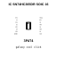
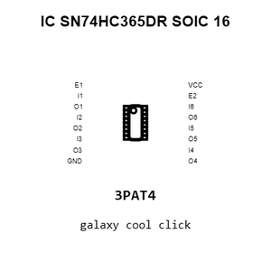
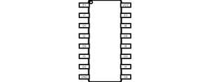
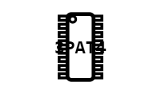
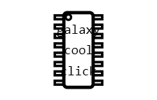
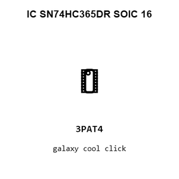
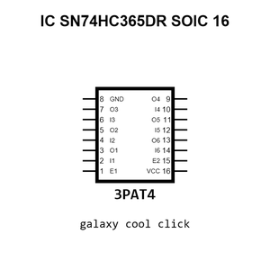

# IC SN74HC365DR SOIC 16

`electronic_ic_soic_16_logic_hex_bus_buffer_tri_state_texas_instruments_sn74hc365dr`

IC SN74HC365DR SOIC 16 is an OOMP electronic ic definition. It uses the soic 16 package or form factor. Its nominal drawing size is 9.9 &#x00D7; 3.9 mm. The definition includes 16 documented pins.

## At a glance

| Detail | Value |
| --- | --- |
| OOMP ID | `electronic_ic_soic_16_logic_hex_bus_buffer_tri_state_texas_instruments_sn74hc365dr` |
| Type | Ic |
| Package / style | soic 16 |
| Nominal size | 9.9 &#x00D7; 3.9 mm |
| Documented pins | 16 |

## Classification

| Level | Value |
| --- | --- |
| 1 | `electronic` |
| 2 | `ic` |
| 3 | `soic_16` |
| 4 | `logic` |
| 5 | `hex_bus_buffer_tri_state` |
| 14 | `texas_instruments` |
| 15 | `sn74hc365dr` |

## Nominal dimensions

| Measurement | Value |
| --- | ---: |
| Height | 1.75 mm |
| Length | 9.9 mm |
| Width | 3.9 mm |

## Identifiers

| Identifier | Value |
| --- | --- |
| Manufacturer part number | `SN74HC365DR` |
| LCSC | [`C6841`](https://www.lcsc.com/product-detail/C6841.html) |
| JLCPCB | [`C6841`](https://jlcpcb.com/partdetail/TexasInstruments-SN74HC365DR/C6841) |

## Pins

| Pin | Name | Type |
| ---: | --- | --- |
| 1 | E1 | in |
| 2 | I1 | in |
| 3 | O1 | ts |
| 4 | I2 | in |
| 5 | O2 | ts |
| 6 | I3 | in |
| 7 | O3 | ts |
| 8 | GND | pwr |
| 9 | O4 | ts |
| 10 | I4 | in |
| 11 | O5 | ts |
| 12 | I5 | in |
| 13 | O6 | ts |
| 14 | I6 | in |
| 15 | E2 | in |
| 16 | VCC | pwr |

## Datasheet

[View the datasheet](data/datasheet.pdf)

## Files

[KiCad symbol, machine-solder and hand-solder footprints](data/kicad/README.md) · [Availability and source masters](data/kicad/manifest.yaml)

[View this part on GitHub](https://github.com/oomlout/oomp_electronic_version_5/tree/main/parts/electronic_ic_soic_16_logic_hex_bus_buffer_tri_state_texas_instruments_sn74hc365dr)

[Browse this category](../../navigation/electronic/ic/soic_16/logic/hex_bus_buffer_tri_state/texas_instruments/README.md)

---

This page is generated from the OOMP part definition by a Roboclick Jinja template. Edit the source taxonomy or template rather than this generated file.