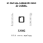
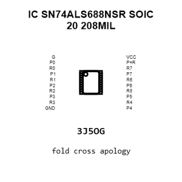
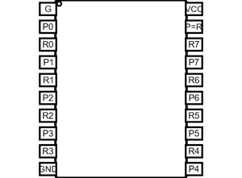
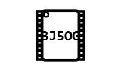
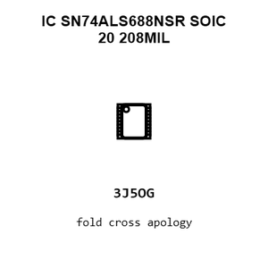
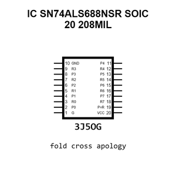
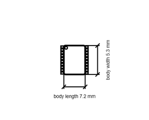

# IC SN74ALS688NSR SOIC 20 208MIL

`electronic_ic_soic_20_208mil_logic_8_bit_identity_comparator_texas_instruments_sn74als688nsr`

IC SN74ALS688NSR SOIC 20 208MIL is an OOMP electronic ic definition. It uses the soic 20 208mil package or form factor. Its nominal drawing size is 7.2 &#x00D7; 5.3 mm. The definition includes 20 documented pins.

## At a glance

| Detail | Value |
| --- | --- |
| OOMP ID | `electronic_ic_soic_20_208mil_logic_8_bit_identity_comparator_texas_instruments_sn74als688nsr` |
| Type | Ic |
| Package / style | soic 20 208mil |
| Nominal size | 7.2 &#x00D7; 5.3 mm |
| Documented pins | 20 |

## Classification

| Level | Value |
| --- | --- |
| 1 | `electronic` |
| 2 | `ic` |
| 3 | `soic_20_208mil` |
| 4 | `logic` |
| 5 | `8_bit_identity_comparator` |
| 14 | `texas_instruments` |
| 15 | `sn74als688nsr` |

## Nominal dimensions

| Measurement | Value |
| --- | ---: |
| Height | 1.98 mm |
| Length | 7.2 mm |
| Width | 5.3 mm |

## Identifiers

| Identifier | Value |
| --- | --- |
| Manufacturer part number | `SN74ALS688NSR` |
| LCSC | [`C7125`](https://www.lcsc.com/product-detail/C7125.html) |
| JLCPCB | [`C7125`](https://jlcpcb.com/partdetail/TexasInstruments-SN74ALS688NSR/C7125) |

## Pins

| Pin | Name | Type |
| ---: | --- | --- |
| 1 | G | in |
| 2 | P0 | in |
| 3 | R0 | in |
| 4 | P1 | in |
| 5 | R1 | in |
| 6 | P2 | in |
| 7 | R2 | in |
| 8 | P3 | in |
| 9 | R3 | in |
| 10 | GND | pwr |
| 11 | P4 | in |
| 12 | R4 | in |
| 13 | P5 | in |
| 14 | R5 | in |
| 15 | P6 | in |
| 16 | R6 | in |
| 17 | P7 | in |
| 18 | R7 | in |
| 19 | P=R | out |
| 20 | VCC | pwr |

## Datasheet

[View the datasheet](data/datasheet.pdf)

## Files

[KiCad symbol, machine-solder and hand-solder footprints](data/kicad/README.md) · [Availability and source masters](data/kicad/manifest.yaml)

[View this part on GitHub](https://github.com/oomlout/oomp_electronic_version_5/tree/main/parts/electronic_ic_soic_20_208mil_logic_8_bit_identity_comparator_texas_instruments_sn74als688nsr)

[Browse this category](../../navigation/electronic/ic/soic_20_208mil/logic/8_bit_identity_comparator/texas_instruments/README.md)

---

This page is generated from the OOMP part definition by a Roboclick Jinja template. Edit the source taxonomy or template rather than this generated file.