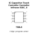
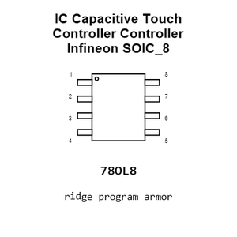
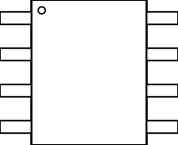
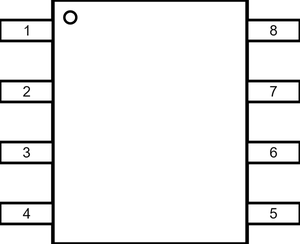
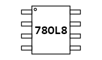
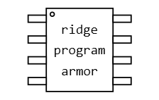
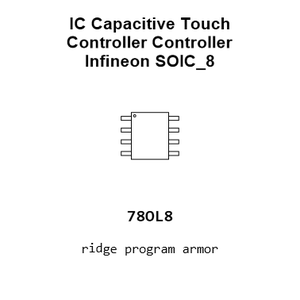
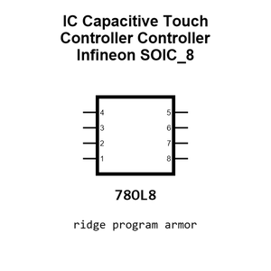
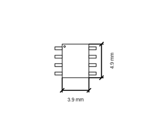
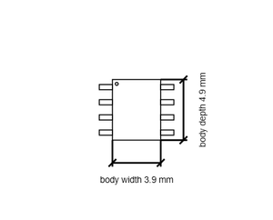

# IC Capacitive Touch Controller Controller Infineon SOIC_8

`electronic_ic_soic_8_capacitive_touch_controller_controller_infineon_cy8cmbr3102`

IC Capacitive Touch Controller Controller Infineon SOIC_8 is an OOMP electronic ic definition. It uses the soic 8 package or form factor. Its nominal drawing size is 4.9 &#x00D7; 3.9 mm. The definition includes 8 documented pins.

## At a glance

| Detail | Value |
| --- | --- |
| OOMP ID | `electronic_ic_soic_8_capacitive_touch_controller_controller_infineon_cy8cmbr3102` |
| Type | Ic |
| Package / style | soic 8 |
| Nominal size | 4.9 &#x00D7; 3.9 mm |
| Documented pins | 8 |

## Classification

| Level | Value |
| --- | --- |
| 1 | `electronic` |
| 2 | `ic` |
| 3 | `soic_8` |
| 4 | `capacitive_touch_controller` |
| 5 | `controller` |
| 14 | `infineon` |
| 15 | `cy8cmbr3102` |

## Nominal dimensions

| Measurement | Value |
| --- | ---: |
| Height | 1.75 mm |
| Length | 4.9 mm |
| Width | 3.9 mm |

## Pins

| Pin | Name | Type |
| ---: | --- | --- |
| 1 | 1 | signal |
| 2 | 2 | signal |
| 3 | 3 | signal |
| 4 | 4 | signal |
| 5 | 5 | signal |
| 6 | 6 | signal |
| 7 | 7 | signal |
| 8 | 8 | signal |

## Used in projects

| Project | Quantity | References | Explore |
| --- | ---: | --- | --- |
| [Project sparkfun/SparkFun_Capacitive_Soil_Moisture_Sensor_CY8CMBR3102 Capacitive Soil Moisture Sensor CY8CMBR3102 current](https://github.com/sparkfun/SparkFun_Capacitive_Soil_Moisture_Sensor_CY8CMBR3102) | 1 | U1 | [Board explorer](https://oomlout.github.io/oomp_electronic_version_5/parts/oomp_project_github_sparkfun_spark_fun_capacitive_soil_moisture_sensor_cy8_cmbr3102_capacitive_soil_moisture_cy8cmbr3102_current/board_explorer.html) · [OOMP project](https://github.com/oomlout/oomp_electronic_version_5/tree/main/parts/oomp_project_github_sparkfun_spark_fun_capacitive_soil_moisture_sensor_cy8_cmbr3102_capacitive_soil_moisture_cy8cmbr3102_current) |

## Files

[KiCad symbol, machine-solder and hand-solder footprints](data/kicad/README.md) · [Availability and source masters](data/kicad/manifest.yaml)

[View this part on GitHub](https://github.com/oomlout/oomp_electronic_version_5/tree/main/parts/electronic_ic_soic_8_capacitive_touch_controller_controller_infineon_cy8cmbr3102)

[Browse this category](../../navigation/electronic/ic/soic_8/capacitive_touch_controller/controller/infineon/README.md)

---

This page is generated from the OOMP part definition by a Roboclick Jinja template. Edit the source taxonomy or template rather than this generated file.