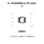
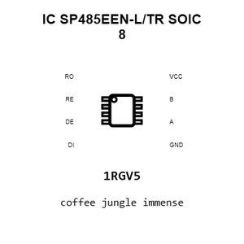
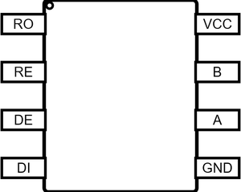
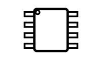
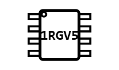
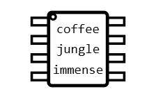
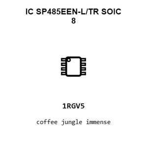
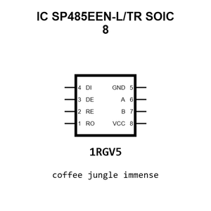

# IC SP485EEN-L/TR SOIC 8

`electronic_ic_soic_8_interface_rs_485_transceiver_maxlinear_sp485een_l_tr`

IC SP485EEN-L/TR SOIC 8 is an OOMP electronic ic definition. It uses the soic 8 package or form factor. Its nominal drawing size is 4.9 &#x00D7; 3.9 mm. The definition includes 8 documented pins.

## At a glance

| Detail | Value |
| --- | --- |
| OOMP ID | `electronic_ic_soic_8_interface_rs_485_transceiver_maxlinear_sp485een_l_tr` |
| Type | Ic |
| Package / style | soic 8 |
| Nominal size | 4.9 &#x00D7; 3.9 mm |
| Documented pins | 8 |

## Classification

| Level | Value |
| --- | --- |
| 1 | `electronic` |
| 2 | `ic` |
| 3 | `soic_8` |
| 4 | `interface` |
| 5 | `rs_485_transceiver` |
| 14 | `maxlinear` |
| 15 | `sp485een_l_tr` |

## Nominal dimensions

| Measurement | Value |
| --- | ---: |
| Height | 1.75 mm |
| Length | 4.9 mm |
| Width | 3.9 mm |

## Identifiers

| Identifier | Value |
| --- | --- |
| Manufacturer part number | `SP485EEN-L/TR` |
| LCSC | [`C6855`](https://www.lcsc.com/product-detail/C6855.html) |
| JLCPCB | [`C6855`](https://jlcpcb.com/partdetail/MaxLinear-SP485EEN_LTR/C6855) |

## Pins

| Pin | Name | Type |
| ---: | --- | --- |
| 1 | RO | output |
| 2 | RE | input |
| 3 | DE | input |
| 4 | DI | input |
| 5 | GND | power_in |
| 6 | A | bidirectional |
| 7 | B | bidirectional |
| 8 | VCC | power_in |

## Datasheet

[View the datasheet](data/datasheet.pdf)

## Files

[KiCad symbol, machine-solder and hand-solder footprints](data/kicad/README.md) · [Availability and source masters](data/kicad/manifest.yaml)

[View this part on GitHub](https://github.com/oomlout/oomp_electronic_version_5/tree/main/parts/electronic_ic_soic_8_interface_rs_485_transceiver_maxlinear_sp485een_l_tr)

[Browse this category](../../navigation/electronic/ic/soic_8/interface/rs_485_transceiver/maxlinear/README.md)

---

This page is generated from the OOMP part definition by a Roboclick Jinja template. Edit the source taxonomy or template rather than this generated file.